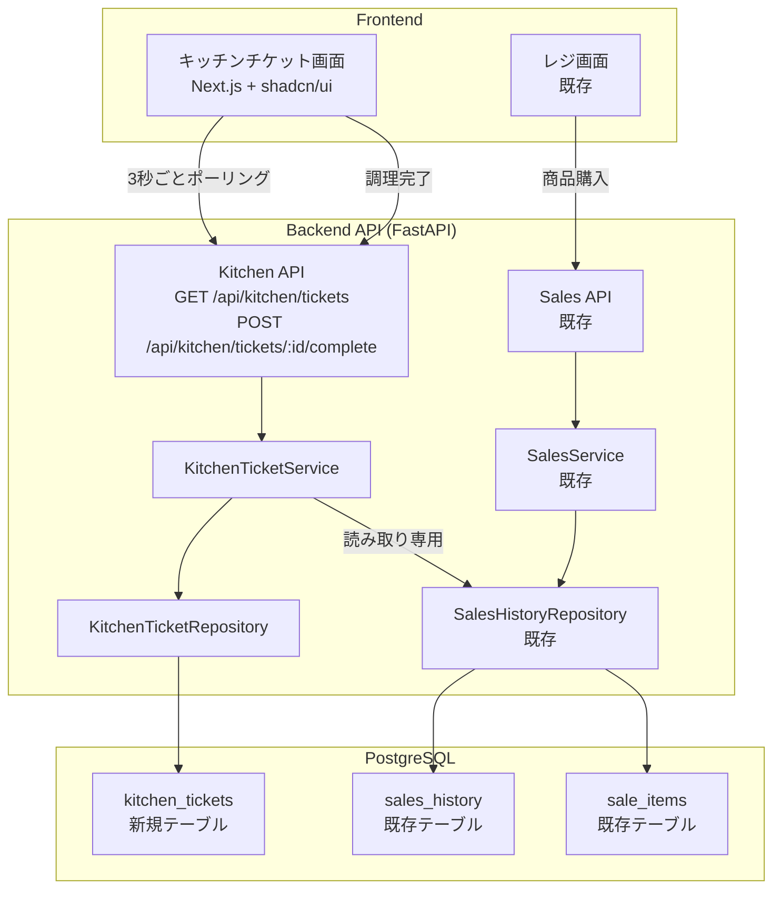
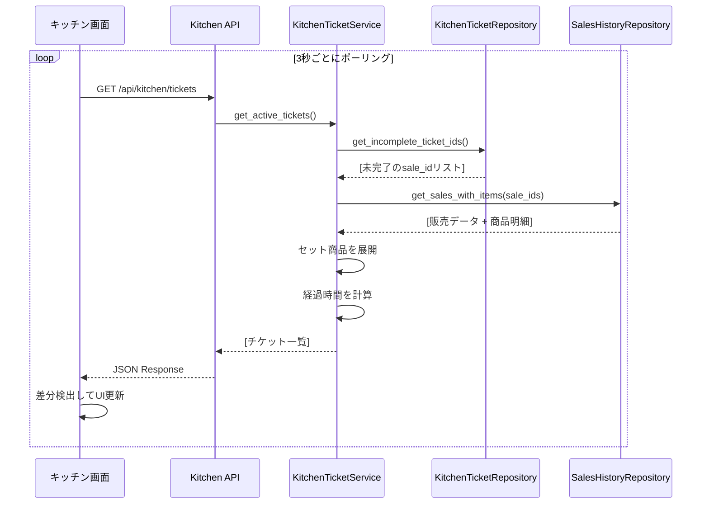
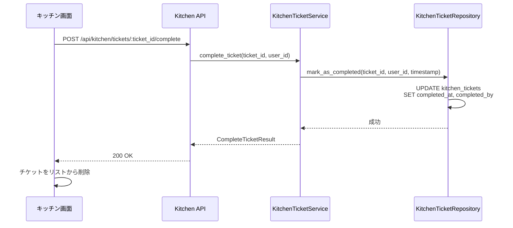
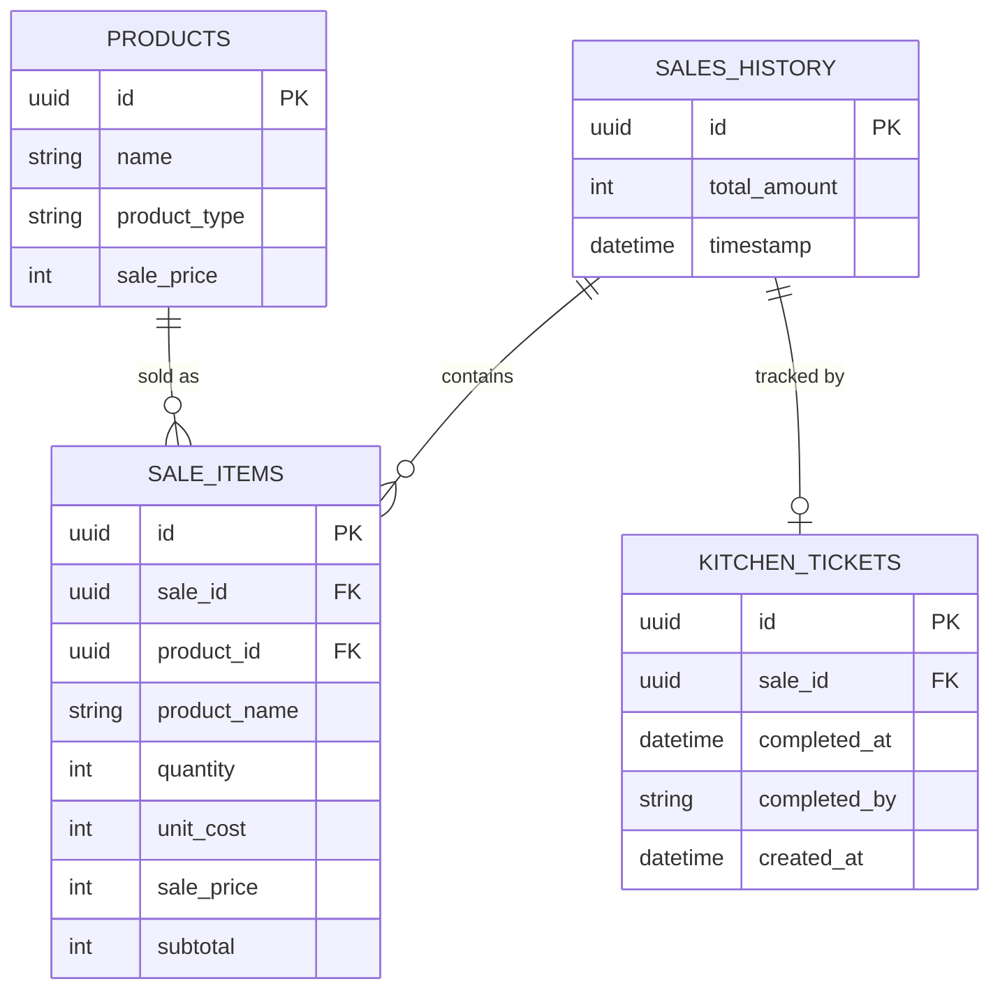
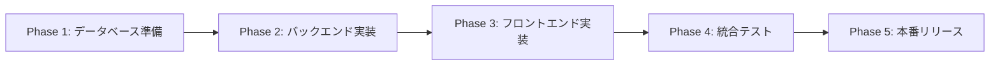

# 技術設計書 - 料理人向け半券機能

## 概要

本機能は、MogiPay システムにおける料理人向けのキッチンチケット管理システムを提供します。レジで購入された商品が自動的に料理人の画面に表示され、調理完了時にチケットを削除できる仕組みを実装します。

**目的**: 料理人がレジでの注文をリアルタイムで確認し、調理の進捗を効率的に管理できるようにする。

**ユーザー**: 学園祭模擬店の料理担当者が、注文内容を確認して調理を行い、完了時にチケットを削除する。

**影響**: 既存の販売システム(SalesService)に対して読み取り専用のインターフェースを追加し、新たにキッチンチケット管理のドメインを導入する。既存の販売データベーステーブルはそのまま活用し、新たにチケット完了状態を管理するテーブルを追加する。

### ゴール

- レジでの商品購入から 3 秒以内にキッチン画面に反映
- 注文受付順にチケットを表示し、調理の公平性を担保
- タッチ操作で簡単に調理完了を記録できる UI を提供
- 単品とセット商品を視覚的に区別して表示

### 非ゴール

- 複数の料理人間でのチケット割り当て機能(将来検討)
- 調理時間の予測や推奨機能(将来検討)
- 在庫管理との直接連携(既存の SalesService で処理済み)
- リアルタイム通信は WebSocket ではなくポーリングで実装(技術的制約)

## アーキテクチャ

### 既存アーキテクチャ分析

MogiPay システムは以下のレイヤードアーキテクチャを採用しています:

- **API Layer** (`app/api/`): FastAPI ルーター、リクエスト/レスポンス処理
- **Service Layer** (`app/services/`): ビジネスロジック、トランザクション管理
- **Repository Layer** (`app/repositories/`): データアクセス、ORM 操作
- **Model Layer** (`app/models/`): SQLAlchemy ORM モデル、データベーステーブル定義
- **Schema Layer** (`app/schemas/`): Pydantic モデル、データ検証

**既存のドメイン境界**:

- **Sales Domain**: 販売トランザクション(`SalesHistory`, `SaleItem`)を管理
- **Product Domain**: 商品マスタ(`Product`, `SetItem`)を管理
- **Inventory Domain**: 在庫管理(`InventoryService`)を担当

**統合ポイント**:

- キッチンチケットシステムは Sales Domain のデータを読み取り専用で参照
- 新たに Kitchen Domain を追加し、チケット完了状態を独立して管理

### ハイレベルアーキテクチャ



### アーキテクチャ統合

**既存パターンの維持**:

- レイヤードアーキテクチャの継続適用(API → Service → Repository → Model)
- Repository パターンによるデータアクセスの抽象化
- Pydantic Schema による型安全なデータ検証
- FastAPI の依存性注入を活用したサービス結合

**新規コンポーネントの根拠**:

- `KitchenTicketService`: チケット取得と完了処理のビジネスロジックをカプセル化
- `KitchenTicketRepository`: チケット完了状態の永続化を責務分離
- `kitchen_tickets` テーブル: 販売履歴とは独立したチケット完了状態の管理

**技術スタック整合性**:

- FastAPI、SQLAlchemy、Pydantic の既存スタックを継続使用
- PostgreSQL 16 を引き続きデータベースとして利用
- Next.js + shadcn/ui でフロントエンドを構築(既存と同様)

**ステアリング準拠**:

- 単一責任の原則: 各サービスとリポジトリは明確な責務を持つ
- 依存性逆転: Service が Repository 抽象に依存
- YAGNI 原則: WebSocket などの複雑な機能は実装せず、ポーリングで十分

### 技術スタック整合性

本機能は既存の MogiPay システムの技術スタックに完全に準拠します。

**バックエンド**:

- FastAPI (既存): REST API エンドポイントの提供
- SQLAlchemy (既存): ORM によるデータベース操作
- Pydantic (既存): リクエスト/レスポンスのデータ検証
- PostgreSQL 16 (既存): データ永続化

**フロントエンド**:

- Next.js (既存): React ベースのフロントエンドフレームワーク
- shadcn/ui (既存): UI コンポーネントライブラリ
- TypeScript (既存): 型安全な開発

**新規依存関係**:

なし。既存のライブラリとフレームワークのみを使用します。

### 主要な設計判断

#### 判断 1: ポーリングベースのリアルタイム更新

**決定**: WebSocket ではなく、3 秒間隔のポーリングでチケット更新を実現する

**コンテキスト**: キッチンチケットシステムは最新の注文状況をリアルタイムに近い形で表示する必要があるが、厳密なリアルタイム性(100ms 以下)は求められていない。

**代替案**:

1. **WebSocket による双方向通信**: サーバーからクライアントへのプッシュ通知で即座に更新
2. **Server-Sent Events (SSE)**: サーバーからクライアントへの一方向ストリーミング
3. **ポーリング**: クライアントが定期的にサーバーにリクエストを送信

**選択したアプローチ**: 3 秒間隔のポーリング

- クライアントが `GET /api/kitchen/tickets` を 3 秒ごとに呼び出し
- サーバーは現在の未完了チケット一覧を返却
- フロントエンドは差分を検出して UI を更新

**根拠**:

- 要件で許容されているレスポンスタイム(3 秒以内)を満たす
- WebSocket のようなステートフル接続管理の複雑性を回避
- FastAPI の既存の REST API パターンと統一性を保つ
- 学園祭の短期間利用では、ポーリングのトラフィックオーバーヘッドは許容範囲
- インフラのスケーラビリティがシンプル(WebSocket は接続数管理が必要)

**トレードオフ**:

- **獲得**: 実装のシンプルさ、既存アーキテクチャとの整合性、インフラの単純化
- **犠牲**: リアルタイム性(最大 3 秒の遅延)、ネットワークトラフィックの増加(ただし規模が小さいため影響は軽微)

#### 判断 2: チケット完了状態の独立テーブル管理

**決定**: 販売履歴テーブルにステータスカラムを追加するのではなく、独立した `kitchen_tickets` テーブルでチケット完了状態を管理する

**コンテキスト**: キッチンチケットの完了状態は、販売トランザクションそのものとは異なるドメイン概念である。販売は「お金のやり取り」、チケット完了は「調理の完了」を表す。

**代替案**:

1. **sales_history テーブルに status カラムを追加**: `pending`, `completed` などのステータスで管理
2. **sale_items テーブルに kitchen_status カラムを追加**: 商品ごとの調理状態を管理
3. **独立した kitchen_tickets テーブル**: sale_id を外部キーとして参照し、チケット完了情報を別管理

**選択したアプローチ**: 独立した `kitchen_tickets` テーブル

```sql
CREATE TABLE kitchen_tickets (
    id UUID PRIMARY KEY,
    sale_id UUID NOT NULL REFERENCES sales_history(id),
    completed_at TIMESTAMP,
    completed_by VARCHAR(255),
    created_at TIMESTAMP NOT NULL DEFAULT NOW()
);
```

**根拠**:

- **ドメイン分離**: Sales Domain と Kitchen Domain を明確に分離し、それぞれの責務を独立させる
- **既存テーブルへの影響最小化**: `sales_history` テーブルは会計や分析で使われており、キッチン特有のカラムを追加すると責務が曖昧になる
- **将来の拡張性**: キッチン特有の情報(調理優先度、割り当て料理人など)を追加しやすい
- **クエリパフォーマンス**: 未完了チケット検索時に `kitchen_tickets` テーブルだけをスキャンすれば良い

**トレードオフ**:

- **獲得**: ドメイン境界の明確化、既存テーブルの保護、将来の拡張性
- **犠牲**: JOIN が必要になる(ただし、インデックス最適化で性能問題は回避可能)

#### 判断 3: セット商品の展開表示ロジック

**決定**: バックエンドでセット商品を構成要素に展開し、フロントエンドには展開済みデータを渡す

**コンテキスト**: セット商品は複数の単品商品の組み合わせであり、料理人は「セット名」と「含まれる単品リスト」の両方を確認する必要がある。

**代替案**:

1. **フロントエンドで展開**: API はセット商品の ID のみを返し、フロントエンドが別途 `set_items` テーブルを参照して展開
2. **バックエンドで展開**: API がセット商品の構成要素を含む完全なデータ構造を返却
3. **展開しない**: セット商品はセット名のみ表示し、詳細は料理人が記憶

**選択したアプローチ**: バックエンドで展開

レスポンス例:

```json
{
  "id": "ticket-uuid",
  "sale_id": "sale-uuid",
  "order_time": "2025-11-07T10:30:00Z",
  "elapsed_minutes": 5,
  "items": [
    {
      "product_name": "セットA",
      "product_type": "set",
      "quantity": 2,
      "components": [
        { "name": "ハンバーガー", "quantity": 2 },
        { "name": "ポテト", "quantity": 2 }
      ]
    },
    {
      "product_name": "コーラ",
      "product_type": "single",
      "quantity": 1,
      "components": null
    }
  ]
}
```

**根拠**:

- **フロントエンドの責務軽減**: UI はデータ表示に専念し、ビジネスロジック(セット展開)はバックエンドに集約
- **ネットワーク効率**: 1 回の API 呼び出しで必要な全データを取得
- **一貫性保証**: セット商品の定義変更があっても、API のレスポンス形式は一貫
- **キャッシュ最適化**: フロントエンドは受け取ったデータをそのまま表示すれば良い

**トレードオフ**:

- **獲得**: フロントエンドのシンプルさ、ネットワーク効率、データ一貫性
- **犠牲**: バックエンドの複雑性がわずかに増加(ただし、既存の `SetItemRepository` を再利用するため影響は小さい)

## システムフロー

### シーケンス図: チケット取得フロー



### シーケンス図: チケット完了フロー



## 要件トレーサビリティ

| 要件  | 要件概要                   | コンポーネント                        | インターフェース                       | フロー             |
| ----- | -------------------------- | ------------------------------------- | -------------------------------------- | ------------------ |
| 1.1   | 単品商品の自動表示         | KitchenTicketService, SalesRepository | GET /api/kitchen/tickets               | チケット取得フロー |
| 1.2   | セット商品の自動表示       | KitchenTicketService, SetItemRepo     | GET /api/kitchen/tickets (components)  | チケット取得フロー |
| 1.3   | 複数商品の個別チケット表示 | KitchenTicketService                  | GET /api/kitchen/tickets (items 配列)  | チケット取得フロー |
| 2.1   | 時系列順ソート             | KitchenTicketService                  | GET /api/kitchen/tickets (ORDER BY)    | チケット取得フロー |
| 2.2   | 新規注文の自動挿入         | ポーリングメカニズム                  | 3 秒ごとの GET リクエスト              | チケット取得フロー |
| 2.3   | 経過時間表示               | KitchenTicketService                  | elapsed_minutes フィールド             | チケット取得フロー |
| 3.1   | 調理完了ボタン提供         | キッチン UI コンポーネント            | POST /api/kitchen/tickets/:id/complete | チケット完了フロー |
| 3.2   | チケット削除               | KitchenTicketRepository               | mark_as_completed()                    | チケット完了フロー |
| 3.4   | 完了記録                   | kitchen_tickets テーブル              | completed_at, completed_by カラム      | チケット完了フロー |
| 4.1-4 | 単品商品表示仕様           | キッチン UI コンポーネント            | product_type: "single"                 | UI レンダリング    |
| 5.1-5 | セット商品表示仕様         | キッチン UI コンポーネント            | product_type: "set", components 配列   | UI レンダリング    |
| 6.1   | 3 秒以内の更新             | ポーリングメカニズム                  | 3 秒間隔のポーリング                   | チケット取得フロー |
| 7.1-4 | 操作性とユーザビリティ     | キッチン UI コンポーネント            | shadcn/ui によるタッチ最適化 UI        | UI レンダリング    |

## コンポーネントとインターフェース

### Kitchen Domain

#### KitchenTicketService

**責務と境界**

- **主要責務**: キッチンチケットの取得、完了処理、経過時間計算を管理
- **ドメイン境界**: Kitchen Domain に属し、チケット表示と完了状態を管理
- **データ所有権**: `kitchen_tickets` テーブルの完了状態を所有し、`sales_history` は読み取り専用で参照
- **トランザクション境界**: チケット完了処理は単一トランザクションで完結(sales_history は更新しない)

**依存関係**

- **インバウンド**: `KitchenController` (API レイヤー)がこのサービスに依存
- **アウトバウンド**: `KitchenTicketRepository`, `SalesHistoryRepository`, `SetItemRepository` に依存
- **外部**: なし(全て内部コンポーネント)

**契約定義**

**サービスインターフェース**:

```typescript
interface KitchenTicketService {
  // アクティブなチケット一覧を取得(未完了のみ)
  getActiveTickets(db: Session): Result<List<KitchenTicket>, ServiceError>;

  // チケットを完了としてマーク
  completeTicket(
    ticketId: UUID,
    userId: string,
    db: Session
  ): Result<CompleteTicketResult, ServiceError>;
}

type KitchenTicket = {
  id: UUID;
  saleId: UUID;
  orderTime: datetime;
  elapsedMinutes: number;
  items: KitchenTicketItem[];
};

type KitchenTicketItem = {
  productName: string;
  productType: "single" | "set";
  quantity: number;
  components: ComponentItem[] | null; // setの場合のみ
};

type ComponentItem = {
  name: string;
  quantity: number;
};

type CompleteTicketResult = {
  ticketId: UUID;
  completedAt: datetime;
  completedBy: string;
};

type ServiceError =
  | { type: "NOT_FOUND"; message: string }
  | { type: "ALREADY_COMPLETED"; message: string }
  | { type: "DATABASE_ERROR"; message: string };
```

**事前条件**:

- `getActiveTickets`: データベースセッションが有効
- `completeTicket`: ticket_id が存在し、まだ完了していない

**事後条件**:

- `getActiveTickets`: 未完了チケットが注文時刻の古い順でソートされて返却される
- `completeTicket`: チケットが完了済みとしてマークされ、完了時刻と処理者が記録される

**不変条件**:

- 完了済みチケットは `getActiveTickets` の結果に含まれない
- 経過時間は常に現在時刻との差分で正確に計算される

**状態管理**:

- **状態モデル**: チケットは `active` (未完了) または `completed` (完了済み) の 2 状態
- **状態遷移**: `active` → `completed` のみ(逆方向の遷移は不可)
- **永続化**: `kitchen_tickets` テーブルに完了状態を永続化
- **並行制御**: チケット完了時に楽観的ロック(completed_at が NULL のもののみ更新)

#### KitchenTicketRepository

**責務と境界**

- **主要責務**: `kitchen_tickets` テーブルへのデータアクセスを抽象化
- **ドメイン境界**: Kitchen Domain のデータ永続化層
- **データ所有権**: `kitchen_tickets` テーブルの CRUD 操作を独占的に所有
- **トランザクション境界**: 単一テーブル操作のため、トランザクションはサービス層で管理

**依存関係**

- **インバウンド**: `KitchenTicketService` がこのリポジトリに依存
- **アウトバウンド**: `kitchen_tickets` テーブル(SQLAlchemy ORM)
- **外部**: なし

**契約定義**

**サービスインターフェース**:

```typescript
interface KitchenTicketRepository {
  // 未完了チケットのsale_idリストを取得
  getIncompleteSaleIds(db: Session): List<UUID>;

  // 新しいチケットを作成
  createTicket(saleId: UUID, db: Session): KitchenTicketModel;

  // チケットを完了としてマーク
  markAsCompleted(
    ticketId: UUID,
    completedBy: string,
    completedAt: datetime,
    db: Session
  ): Result<None, RepositoryError>;

  // sale_idからチケットを取得
  getTicketBySaleId(saleId: UUID, db: Session): KitchenTicketModel | null;
}

type RepositoryError =
  | { type: "NOT_FOUND"; message: string }
  | { type: "DATABASE_ERROR"; message: string };
```

**事前条件**:

- `createTicket`: sale_id が `sales_history` テーブルに存在する
- `markAsCompleted`: ticket_id が存在し、completed_at が NULL

**事後条件**:

- `createTicket`: 新しいチケットレコードがデータベースに作成される
- `markAsCompleted`: チケットの completed_at と completed_by が更新される

**不変条件**:

- 1 つの sale_id に対して kitchen_ticket は 1 つまで(UNIQUE 制約)
- completed_at が NULL のチケットのみが未完了とみなされる

### API Layer

#### KitchenController

**責務と境界**

- **主要責務**: キッチンチケット API エンドポイントの提供とリクエスト/レスポンス処理
- **ドメイン境界**: API Layer、HTTP プロトコルと Kitchen Domain の橋渡し
- **データ所有権**: なし(データは KitchenTicketService に委譲)

**依存関係**

- **インバウンド**: フロントエンド(Next.js キッチン画面)
- **アウトバウンド**: `KitchenTicketService`
- **外部**: なし

**契約定義**

**API 契約**:

| Method | Endpoint                                 | Request               | Response               | Errors        |
| ------ | ---------------------------------------- | --------------------- | ---------------------- | ------------- |
| GET    | /api/kitchen/tickets                     | なし                  | KitchenTicketList      | 500           |
| POST   | /api/kitchen/tickets/:ticket_id/complete | CompleteTicketRequest | CompleteTicketResponse | 404, 409, 500 |

**詳細スキーマ**:

```typescript
// GET /api/kitchen/tickets
type KitchenTicketListResponse = {
  tickets: KitchenTicket[];
};

type KitchenTicket = {
  id: string; // UUID
  sale_id: string; // UUID
  order_time: string; // ISO 8601
  elapsed_minutes: number;
  items: KitchenTicketItem[];
};

type KitchenTicketItem = {
  product_name: string;
  product_type: "single" | "set";
  quantity: number;
  components: ComponentItem[] | null;
};

type ComponentItem = {
  name: string;
  quantity: number;
};

// POST /api/kitchen/tickets/:ticket_id/complete
type CompleteTicketRequest = {
  completed_by: string; // ユーザー識別子
};

type CompleteTicketResponse = {
  ticket_id: string; // UUID
  completed_at: string; // ISO 8601
  completed_by: string;
};

// エラーレスポンス
type ErrorResponse = {
  error_code: string;
  message: string;
};
```

**エラーコード**:

- `404 NOT_FOUND`: チケットが存在しない
- `409 CONFLICT`: チケットが既に完了済み
- `500 INTERNAL_SERVER_ERROR`: システムエラー

## データモデル

### 論理データモデル

**エンティティ関係図**:



**エンティティ**:

- **SALES_HISTORY**: 販売トランザクションの集約ルート(既存)
- **SALE_ITEMS**: 販売明細(既存)
- **KITCHEN_TICKETS**: キッチンチケット完了状態(新規)
- **PRODUCTS**: 商品マスタ(既存、参照のみ)

**関係性とカーディナリティ**:

- `SALES_HISTORY` と `KITCHEN_TICKETS`: 1 対 0..1(販売ごとに 0 または 1 つのチケット)
- `SALES_HISTORY` と `SALE_ITEMS`: 1 対多(1 つの販売に複数の明細)
- `PRODUCTS` と `SALE_ITEMS`: 1 対多(1 つの商品が複数回販売される)

**整合性ルール**:

- `kitchen_tickets.sale_id` は `sales_history.id` を参照(外部キー制約)
- `sale_id` は UNIQUE 制約(1 つの販売に対して 1 つのチケットのみ)
- `completed_at` が NULL の場合は未完了、NOT NULL の場合は完了済み

### 物理データモデル

#### kitchen_tickets テーブル(新規)

```sql
CREATE TABLE kitchen_tickets (
    id UUID PRIMARY KEY DEFAULT gen_random_uuid(),
    sale_id UUID NOT NULL UNIQUE,
    completed_at TIMESTAMP,
    completed_by VARCHAR(255),
    created_at TIMESTAMP NOT NULL DEFAULT NOW(),

    CONSTRAINT fk_sale_id FOREIGN KEY (sale_id)
        REFERENCES sales_history(id) ON DELETE CASCADE,
    CONSTRAINT unique_sale_ticket UNIQUE (sale_id)
);

-- インデックス
CREATE INDEX idx_kitchen_tickets_completed
    ON kitchen_tickets(completed_at)
    WHERE completed_at IS NULL;
```

**カラム定義**:

- `id`: チケット UUID(主キー)
- `sale_id`: 販売トランザクション UUID(外部キー、UNIQUE)
- `completed_at`: 完了日時(NULL = 未完了)
- `completed_by`: 完了処理者のユーザー識別子
- `created_at`: チケット作成日時(販売時刻とほぼ同じ)

**インデックス戦略**:

- `idx_kitchen_tickets_completed`: 未完了チケット検索の高速化(partial index)
- `sale_id` の UNIQUE 制約により、sale_id による検索も高速

**パーティショニング**:

学園祭の短期間運用のため、パーティショニングは不要。将来的に履歴データが増えた場合は `created_at` による月次パーティショニングを検討。

#### 既存テーブル(参照のみ)

**sales_history テーブル**: 変更なし、読み取り専用で参照

**sale_items テーブル**: 変更なし、読み取り専用で参照

**products テーブル**: 変更なし、商品名取得に使用

**set_items テーブル**: 変更なし、セット商品展開に使用

### データ契約とインテグレーション

**API データ転送**:

- JSON 形式でデータをシリアライズ
- Pydantic スキーマによるバリデーション
- ISO 8601 形式の日時文字列

**バリデーションルール**:

- `completed_by`: 必須、1〜255 文字
- `ticket_id`: UUID 形式
- `sale_id`: 既存の sales_history レコードへの参照

**クロスサービスデータ管理**:

- Kitchen Domain は Sales Domain のデータを読み取り専用で参照
- チケット完了は kitchen_tickets テーブルのみを更新(sales_history は不変)
- トランザクション境界は Kitchen Domain 内で完結

## エラーハンドリング

### エラー戦略

キッチンチケットシステムでは、以下のエラーカテゴリに対して明確な対応戦略を定義します。

**ユーザーエラー(4xx)**: クライアントの不正な操作やリクエストに起因

**システムエラー(5xx)**: サーバー側のインフラや内部処理の失敗に起因

**ビジネスロジックエラー(422)**: ビジネスルール違反

### エラーカテゴリと対応

#### ユーザーエラー(4xx)

| エラーコード       | HTTP ステータス | 発生条件                             | 対応方法                                   |
| ------------------ | --------------- | ------------------------------------ | ------------------------------------------ |
| `TICKET_NOT_FOUND` | 404             | 存在しないチケット ID                | エラーメッセージ表示、チケット一覧を再取得 |
| `INVALID_REQUEST`  | 400             | リクエストボディのバリデーション失敗 | フィールド単位のエラー表示                 |

**フロントエンド対応**:

- `404 TICKET_NOT_FOUND`: 「チケットが見つかりません。画面を更新します」とメッセージ表示後、自動でチケット一覧を再取得
- `400 INVALID_REQUEST`: Pydantic のバリデーションエラーをフィールドごとに表示

#### システムエラー(5xx)

| エラーコード            | HTTP ステータス | 発生条件                 | 対応方法                                   |
| ----------------------- | --------------- | ------------------------ | ------------------------------------------ |
| `INTERNAL_SERVER_ERROR` | 500             | 予期しないサーバーエラー | エラーメッセージ表示、リトライ案内         |
| `DATABASE_ERROR`        | 500             | データベース接続エラー   | 「一時的なエラー」メッセージ、自動リトライ |
| `SERVICE_UNAVAILABLE`   | 503             | サービス過負荷           | 「しばらく待ってから再試行」メッセージ     |

**フロントエンド対応**:

- `500 INTERNAL_SERVER_ERROR`: 「システムエラーが発生しました。しばらく待ってから再度お試しください」と表示
- `DATABASE_ERROR`: 5 秒後に自動リトライ、3 回失敗したらエラーメッセージ固定表示
- `503 SERVICE_UNAVAILABLE`: ポーリング間隔を 10 秒に延長し、負荷軽減

#### ビジネスロジックエラー(422)

| エラーコード               | HTTP ステータス | 発生条件                         | 対応方法                                   |
| -------------------------- | --------------- | -------------------------------- | ------------------------------------------ |
| `TICKET_ALREADY_COMPLETED` | 409             | 既に完了済みのチケットを再度完了 | 「既に完了済みです」メッセージ、リスト更新 |

**フロントエンド対応**:

- `409 TICKET_ALREADY_COMPLETED`: 「このチケットは既に完了済みです」とメッセージ表示し、チケット一覧から該当チケットを削除

### 監視とロギング

**エラートラッキング**:

- 全ての 5xx エラーはサーバーログに記録
- エラー発生時のスタックトレースをログに出力
- エラー頻度をモニタリングし、異常検知時にアラート

**ロギング戦略**:

- `INFO`: API リクエスト/レスポンスのログ
- `WARNING`: リトライ可能なエラー(データベース一時切断など)
- `ERROR`: ユーザー影響のあるエラー(500 エラー)
- `CRITICAL`: サービス全体に影響するエラー(データベース完全停止など)

**ヘルスモニタリング**:

- `/api/health` エンドポイントでサービスの稼働状態を確認
- データベース接続チェックを含むヘルスチェック
- フロントエンドは定期的にヘルスチェックを行い、サービス停止を検知

## テスト戦略

### ユニットテスト

**KitchenTicketService**:

1. `test_get_active_tickets_returns_sorted_by_order_time`: 未完了チケットが注文時刻の古い順で返却されることを検証
2. `test_get_active_tickets_expands_set_products`: セット商品が構成要素に展開されることを検証
3. `test_complete_ticket_marks_as_completed`: チケット完了処理が正しく completed_at と completed_by を記録することを検証
4. `test_complete_ticket_raises_error_if_not_found`: 存在しないチケット ID でエラーが発生することを検証
5. `test_complete_ticket_raises_error_if_already_completed`: 既に完了済みのチケットを再度完了しようとするとエラーが発生することを検証

**KitchenTicketRepository**:

1. `test_get_incomplete_sale_ids_returns_only_uncompleted`: completed_at が NULL のレコードのみが返却されることを検証
2. `test_create_ticket_inserts_record`: チケット作成時にデータベースにレコードが挿入されることを検証
3. `test_mark_as_completed_updates_timestamp`: 完了処理時に completed_at と completed_by が更新されることを検証

### 統合テスト

**API エンドポイント統合テスト**:

1. `test_get_tickets_endpoint_returns_active_tickets`: `GET /api/kitchen/tickets` が未完了チケットを返却
2. `test_get_tickets_endpoint_includes_set_products`: セット商品が展開された状態でレスポンスに含まれる
3. `test_complete_ticket_endpoint_marks_as_completed`: `POST /api/kitchen/tickets/:id/complete` が正常に完了処理を実行
4. `test_complete_ticket_endpoint_returns_404_if_not_found`: 存在しないチケット ID で 404 エラーが返却される
5. `test_complete_ticket_endpoint_returns_409_if_already_completed`: 既に完了済みのチケットで 409 エラーが返却される

**データベース統合テスト**:

1. `test_kitchen_tickets_foreign_key_constraint`: sale_id が存在しない場合に外部キー制約違反が発生
2. `test_kitchen_tickets_unique_constraint`: 同じ sale_id で 2 つのチケットを作成しようとすると UNIQUE 制約違反

### E2E/UI テスト

**キッチン画面の E2E テスト**:

1. `test_kitchen_screen_displays_new_tickets_on_polling`: ポーリングで新しいチケットが表示される
2. `test_kitchen_screen_removes_ticket_on_complete`: 調理完了ボタンを押すとチケットがリストから削除される
3. `test_kitchen_screen_shows_elapsed_time`: 経過時間が正しく表示され、自動更新される
4. `test_kitchen_screen_displays_set_product_components`: セット商品の構成要素が階層的に表示される
5. `test_kitchen_screen_handles_network_error_gracefully`: ネットワークエラー時に適切なエラーメッセージを表示

### パフォーマンステスト

**負荷テスト**:

1. `test_concurrent_ticket_completion`: 複数の料理人が同時にチケットを完了する場合の並行制御を検証
2. `test_polling_performance_with_100_active_tickets`: 100 件の未完了チケットがある状態でのポーリングレスポンス時間が 500ms 以下であることを検証
3. `test_database_query_performance`: チケット取得クエリが適切にインデックスを使用していることを確認(EXPLAIN ANALYZE)

## セキュリティ考慮事項

### 認証と認可

**認証パターン**:

- 既存の MogiPay 認証システム(JWT トークンベース)を継続使用
- キッチン画面へのアクセスには有効な認証トークンが必要
- トークンは Cookie に保存され、API リクエスト時に自動的に送信される

**認可パターン**:

- キッチンチケット API へのアクセスは認証済みユーザーのみ許可
- 将来的に料理人ロールを導入する場合は、ロールベースアクセス制御(RBAC)を実装

### データ保護とプライバシー

**データの機密性**:

- チケット情報には顧客の個人情報は含まれない(商品名と数量のみ)
- 完了処理者の情報(completed_by)は内部識別子のみで個人情報を含まない

**通信の暗号化**:

- 本番環境では HTTPS 通信を必須化(開発環境では HTTP を許可)
- Cookie の Secure フラグを有効化(HTTPS 時のみ送信)

### 脅威モデリング

**潜在的な攻撃ベクトル**:

1. **認証バイパス**: 無効なトークンでの API アクセス試行 → 認証ミドルウェアでブロック
2. **CSRF 攻撃**: 外部サイトからの不正なチケット完了リクエスト → SameSite Cookie 属性で防御
3. **SQL インジェクション**: 不正な入力による SQL 注入 → SQLAlchemy の ORM とパラメータ化クエリで防御
4. **DoS 攻撃**: 過剰なポーリングリクエスト → レート制限の実装(将来検討)

**セキュリティコントロール**:

- FastAPI の依存性注入による認証チェック
- Pydantic バリデーションによる入力検証
- CORS 設定によるオリジン制限(本番環境)

## パフォーマンスとスケーラビリティ

### ターゲットメトリクス

| メトリクス                        | 目標値        | 測定方法                       |
| --------------------------------- | ------------- | ------------------------------ |
| チケット取得 API レスポンス時間   | 500ms 以下    | API レスポンスタイムのログ測定 |
| チケット完了 API レスポンス時間   | 300ms 以下    | API レスポンスタイムのログ測定 |
| 未完了チケット 100 件時の取得時間 | 1000ms 以下   | 負荷テストでの実測             |
| 同時ポーリングユーザー数          | 10 人まで対応 | 並行リクエストテスト           |

### スケーリングアプローチ

**水平スケーリング**:

現時点では学園祭の短期間運用のため、単一サーバー構成で十分。将来的に利用規模が拡大した場合は以下の方針を検討:

- FastAPI アプリケーションのステートレス設計により、複数インスタンスの並列実行が可能
- PostgreSQL の読み取りレプリカを追加し、チケット取得クエリを分散
- ロードバランサー(nginx)による複数 FastAPI インスタンスへの負荷分散

**垂直スケーリング**:

- データベースサーバーのメモリとディスク I/O 性能を強化
- CPU コア数を増やし、FastAPI の並行処理能力を向上

### キャッシング戦略

**アプリケーションレベルキャッシュ**:

現時点では未導入。将来的に以下を検討:

- Redis によるチケット一覧のキャッシュ(TTL: 3 秒)
- チケット完了時にキャッシュを無効化

**データベースレベル最適化**:

- `idx_kitchen_tickets_completed` インデックスによる未完了チケット検索の高速化
- `sale_id` の UNIQUE インデックスによる JOIN 性能向上
- PostgreSQL のクエリプランナー最適化(ANALYZE コマンドの定期実行)

### 最適化テクニック

**クエリ最適化**:

- N+1 問題の回避: `sales_history` と `sale_items` を JOIN で一度に取得
- セット商品の展開も事前に `set_items` テーブルを JOIN して取得
- Partial Index による未完了チケットの高速検索

**ネットワーク最適化**:

- JSON レスポンスの gzip 圧縮(FastAPI のミドルウェアで自動対応)
- ポーリング間隔の調整(ピーク時は 5 秒、閑散時は 10 秒に変更可能)

## マイグレーション戦略

### フェーズ分解



**Phase 1: データベース準備(1 日目)**

- `kitchen_tickets` テーブルの作成(Alembic マイグレーション)
- インデックスと制約の追加
- マイグレーションのテストとロールバック確認

**Phase 2: バックエンド実装(2〜3 日目)**

- `KitchenTicketRepository` の実装とユニットテスト
- `KitchenTicketService` の実装とユニットテスト
- `KitchenController` の実装と API 統合テスト

**Phase 3: フロントエンド実装(4〜5 日目)**

- キッチンチケット画面の UI 実装(Next.js + shadcn/ui)
- ポーリングロジックの実装
- チケット完了処理の実装とエラーハンドリング

**Phase 4: 統合テスト(6 日目)**

- E2E テストの実行
- パフォーマンステスト
- セキュリティテスト

**Phase 5: 本番リリース(7 日目)**

- 本番環境へのデプロイ
- モニタリング設定
- ロールバック手順の確認

### ロールバックトリガー

以下の条件でロールバックを実施:

- **Critical Bug**: チケット完了処理が失敗し、データ不整合が発生
- **Performance Degradation**: API レスポンスタイムが目標値の 2 倍を超える
- **Database Error**: マイグレーションによるデータベース障害

**ロールバック手順**:

1. フロントエンドのキッチン画面へのルーティングを無効化
2. バックエンド API エンドポイントを無効化(404 を返す)
3. Alembic でデータベースマイグレーションをロールバック
4. 旧バージョンのコードにデプロイ

### バリデーションチェックポイント

**Phase 1 完了条件**:

- マイグレーションが成功し、`kitchen_tickets` テーブルが作成される
- インデックスが正しく設定され、クエリプランが最適化されている

**Phase 2 完了条件**:

- 全てのユニットテストと統合テストがパスする
- API エンドポイントが正常にレスポンスを返す

**Phase 3 完了条件**:

- キッチン画面が正しくチケットを表示する
- 調理完了ボタンが正常に動作し、チケットが削除される

**Phase 4 完了条件**:

- E2E テストが全てパスする
- パフォーマンステストが目標値を満たす

**Phase 5 完了条件**:

- 本番環境で正常に動作し、エラーが発生しない
- モニタリングでメトリクスが正常範囲内である
