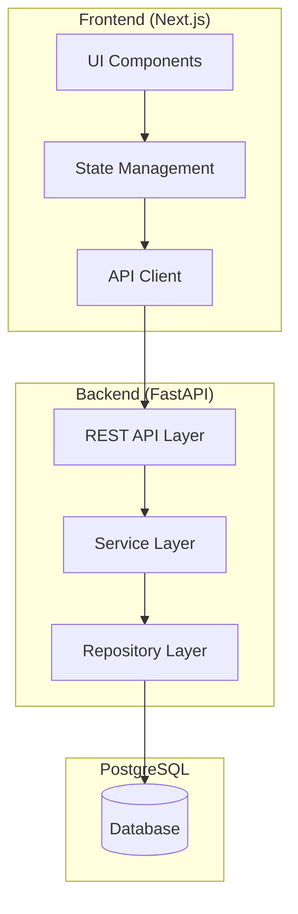
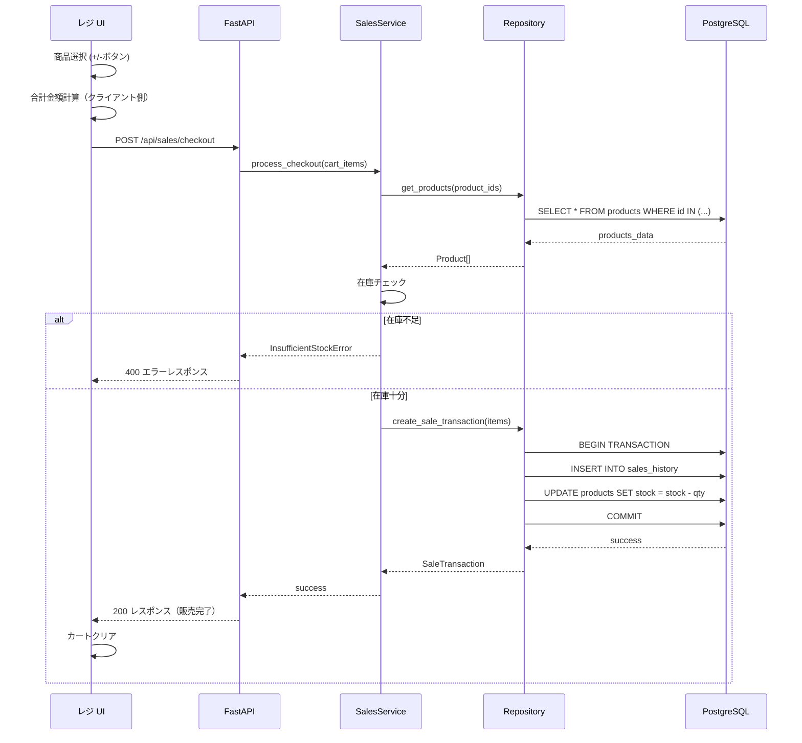
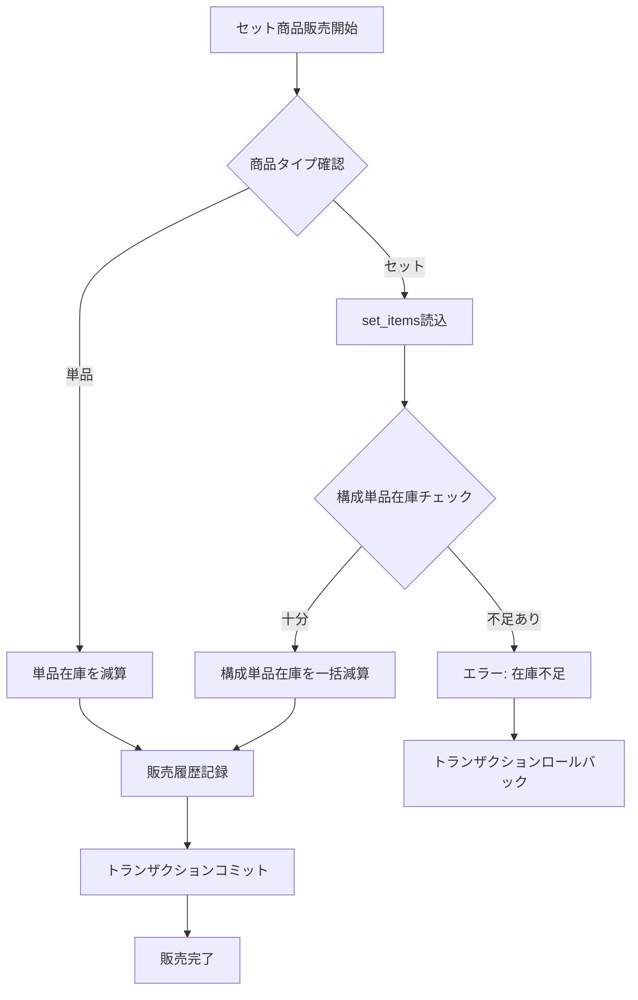
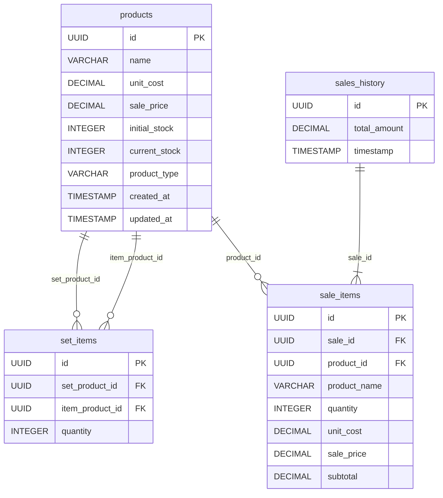
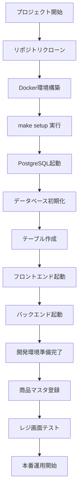

# Technical Design Document

## Overview

MogiPayは、学園祭の模擬店運営を効率化するレジ/売上管理WebAppです。このシステムは、販売員が迅速に会計処理を行い、運営者がリアルタイムで売上・在庫状況を把握できる機能を提供します。

**Purpose**: 学園祭模擬店における販売業務の効率化、正確な在庫管理、リアルタイムな売上分析を実現します。

**Users**:
- **販売員**: レジ画面での商品選択、数量入力、精算処理を行います
- **運営者**: 商品登録、価格変更、売上分析、在庫管理を行います

**Impact**: 従来の手作業による販売記録・在庫管理を置き換え、リアルタイムなデータ管理と分析を可能にします。

### Goals

- タブレット/スマホで操作できる直感的なレジUIの提供
- 単品/セット販売の在庫連動による正確な在庫管理
- 価格変更履歴を保持した販売履歴管理
- 2日間の販売期間における売上進捗のリアルタイム表示
- 初期費用と売上の損益計算機能

### Non-Goals

- 複数店舗の統合管理（単一模擬店向け）
- キャッシュレス決済連携（現金決済のみ）
- 顧客管理機能（匿名購入のみ）
- 在庫発注・仕入管理（入荷登録のみ）

---

## Architecture

### High-Level Architecture



### Technology Stack and Design Decisions

#### Frontend Layer
- **Technology**: Next.js 14 (App Router), TypeScript, shadcn/ui
- **Data Fetching Strategy**: クライアントサイドフェッチのみ（サーバーサイドフェッチは使用しない）
- **Rationale**:
  - Next.jsはReactベースで、shadcn/uiで高品質なUIコンポーネントを迅速に構築できます
  - クライアントサイドフェッチにより、リアルタイム更新とインタラクティブなUIを実現します
  - TypeScriptによる型安全性により、フロントエンドとバックエンドのAPI契約を保証します

#### Backend Layer
- **Technology**: FastAPI, Python 3.12, Layered Architecture
- **Rationale**:
  - FastAPIは高速なAPIパフォーマンス、自動OpenAPI生成、型ヒントによる開発効率を提供します
  - Layered Architecture（Presentation → Service → Repository）により、ビジネスロジックとデータアクセスを分離し、保守性を向上させます

#### Database Layer
- **Technology**: PostgreSQL 18
- **Rationale**:
  - リレーショナルデータベースとして商品、在庫、販売履歴の整合性を保証します
  - トランザクション処理により販売と在庫減算の原子性を保証します
  - JSON型により価格変更履歴などの柔軟なデータ構造を保存できます

#### Infrastructure
- **Technology**: Docker, Docker Compose, Makefile
- **Rationale**:
  - Dockerによるコンテナ化で環境差異を排除し、デプロイを簡素化します
  - Docker Composeでフロントエンド、バックエンド、PostgreSQLを統合管理します
  - Makefileで開発コマンドを統一し、開発者体験を向上させます

#### Architecture Pattern Selection
- **Selected**: Layered Architecture (3-Tier)
- **Rationale**:
  - シンプルなCRUD操作が中心のため、複雑なドメイン駆動設計は不要です
  - Presentation Layer（API）、Service Layer（ビジネスロジック）、Repository Layer（データアクセス）の明確な分離により保守性を確保します

### Key Design Decisions

#### Decision 1: 価格履歴のイミュータブル設計

- **Decision**: 販売履歴に販売時点の価格をスナップショットとして保存し、商品マスタの価格変更と独立させる
- **Context**: 価格変更後も過去の販売履歴の価格整合性を保つ必要があります（Requirement 2）
- **Selected Approach**:
  - `sales_history`テーブルに`unit_cost`, `sale_price`カラムを持ち、販売時点の値をコピーします
  - 商品マスタの価格変更は`products`テーブルの`sale_price`を更新しますが、過去の`sales_history`には影響しません
- **Rationale**:
  - データの不変性により、過去データの整合性を保証します
  - クエリがシンプルになり、パフォーマンスが向上します
  - 会計監査要件に対応できます
- **Trade-offs**:
  - 利点: データ整合性、クエリ性能、監査対応
  - 欠点: ストレージ使用量の微増（販売履歴の価格データ重複）

#### Decision 2: セット商品の在庫管理アプローチ

- **Decision**: セット商品は仮想的な存在とし、構成単品の在庫から動的に在庫数を計算する
- **Context**: セット販売時に構成単品の在庫と連動する必要があります（Requirement 7）
- **Selected Approach**:
  - `products`テーブルに`product_type`（単品 or セット）を持ちます
  - `set_items`テーブルでセット商品と構成単品の関係を管理します
  - セット商品の在庫数は、構成単品の在庫数の最小値を計算します（例: セット={商品A×2, 商品B×1}、商品A在庫10、商品B在庫5 → セット在庫min(10/2, 5/1)=5）
  - セット販売時は`set_items`を参照し、構成単品の在庫を自動的に減算します
- **Rationale**:
  - 在庫の整合性を保証します（単品とセットの在庫が常に一致）
  - セット構成変更時の柔軟性が高くなります
  - トランザクション処理により原子性を保証します
- **Trade-offs**:
  - 利点: 在庫整合性、柔軟性、トランザクション保証
  - 欠点: セット在庫計算のクエリがやや複雑（ただし、キャッシュで対応可能）

#### Decision 3: リアルタイム更新のアプローチ

- **Decision**: ポーリングベースのリアルタイム更新（WebSocketではなく）
- **Context**: 売上・在庫のリアルタイム表示が必要です（Requirement 5, 7）
- **Selected Approach**:
  - フロントエンドが5秒間隔でAPIをポーリングし、最新データを取得します
  - バックエンドは軽量なGETエンドポイントを提供します（`/api/sales/summary`, `/api/inventory/status`）
  - データ変更時はフロントエンドが即座に画面を更新します
- **Rationale**:
  - 2日間の短期イベントであり、同時接続数も限定的（数名程度）のため、ポーリングで十分です
  - 実装がシンプルで、インフラ要件が少なくなります
  - WebSocketサーバーの管理が不要です
- **Trade-offs**:
  - 利点: 実装の簡素化、インフラの軽量化、デバッグの容易さ
  - 欠点: 最大5秒のデータ遅延（ただし、学園祭の使用シナリオでは許容範囲）

---

## System Flows

### レジ販売処理フロー



### セット商品販売の在庫連動フロー



---

## Requirements Traceability

| Requirement | 要件概要 | Components | Interfaces | Flows |
|-------------|---------|-----------|-----------|-------|
| 1.1-1.6 | 商品マスタ管理 | ProductService, ProductRepository | POST/GET/PUT /api/products | - |
| 2.1-2.4 | 動的価格変更 | ProductService, SalesHistoryRepository | PUT /api/products/{id}/price | - |
| 3.1-3.8 | レジ販売処理 | SalesService, InventoryService | POST /api/sales/checkout | レジ販売処理フロー |
| 4.1-4.4 | 販売履歴管理 | SalesHistoryService | GET /api/sales/history | - |
| 5.1-5.5 | 売上進捗管理 | SalesAnalyticsService | GET /api/sales/summary | - |
| 6.1-6.5 | 損益計算 | FinancialService | GET /api/financial/summary | - |
| 7.1-7.7 | 在庫管理 | InventoryService | GET /api/inventory/status | セット商品在庫連動フロー |
| 8.1-8.5 | UI/UX | Frontend Components | - | - |
| 9.1-9.6 | データ整合性 | TransactionManager | - | レジ販売処理フロー |

---

## Components and Interfaces

### Frontend Layer

#### POSScreen Component

**Responsibility & Boundaries**
- **Primary Responsibility**: レジ画面での商品選択、数量入力、合計金額表示、精算処理
- **Domain Boundary**: UI層、ユーザーインタラクションのハンドリング
- **Data Ownership**: 購入カート状態（クライアント側のみ）

**Dependencies**
- **Inbound**: なし（ルートコンポーネント）
- **Outbound**: SalesAPI（精算処理）、ProductAPI（商品リスト取得）
- **External**: shadcn/ui（Button, Card, Badge）

**Contract Definition**

```typescript
interface POSScreenProps {
  // No props - root screen component
}

interface CartItem {
  productId: string;
  productName: string;
  salePrice: number;
  quantity: number;
  subtotal: number;
}

interface POSScreenState {
  cart: CartItem[];
  totalAmount: number;
  availableProducts: Product[];
}

// API Contract
POST /api/sales/checkout
Request: {
  items: Array<{
    product_id: string;
    quantity: number;
  }>;
}
Response: {
  sale_id: string;
  total_amount: number;
  timestamp: string;
}
Errors: 400 (在庫不足), 500 (サーバーエラー)
```

---

#### ProductManagement Component

**Responsibility & Boundaries**
- **Primary Responsibility**: 商品マスタの登録、編集、削除、リスト表示
- **Domain Boundary**: UI層、商品管理画面
- **Data Ownership**: なし（商品データはバックエンドが所有）

**Dependencies**
- **Inbound**: なし（管理画面ルート）
- **Outbound**: ProductAPI（CRUD操作）
- **External**: shadcn/ui（Form, Table, Dialog）

**Contract Definition**

```typescript
interface ProductFormData {
  name: string;
  unitCost: number;
  salePrice: number;
  initialStock: number;
  productType: 'single' | 'set';
  setItems?: Array<{
    productId: string;
    quantity: number;
  }>;
}

// API Contract
POST /api/products
Request: ProductFormData
Response: { product_id: string; }
Errors: 400 (バリデーションエラー), 409 (重複エラー)

PUT /api/products/{id}
Request: Partial<ProductFormData>
Response: { product_id: string; }
Errors: 400, 404 (商品が存在しない)
```

---

#### SalesDashboard Component

**Responsibility & Boundaries**
- **Primary Responsibility**: 売上進捗、在庫状況、損益計算のダッシュボード表示
- **Domain Boundary**: UI層、売上分析画面
- **Data Ownership**: なし（表示専用）

**Dependencies**
- **Inbound**: なし（ダッシュボードルート）
- **Outbound**: SalesAnalyticsAPI、InventoryAPI、FinancialAPI
- **External**: shadcn/ui（Card, Progress, Badge）、Recharts（グラフ描画）

**State Management**
- **Polling Strategy**: 5秒間隔でAPIをポーリング
- **State Update**: 最新データ取得時に画面を再レンダリング

**Contract Definition**

```typescript
interface DashboardData {
  sales: {
    totalRevenue: number;
    dailyRevenue: number[];
    completionRate: number;
  };
  inventory: {
    products: Array<{
      id: string;
      name: string;
      currentStock: number;
      initialStock: number;
      stockRate: number;
    }>;
  };
  financial: {
    totalCost: number;
    totalRevenue: number;
    profit: number;
    breakEvenAchieved: boolean;
  };
}

// API Contract
GET /api/sales/summary
Response: DashboardData['sales']

GET /api/inventory/status
Response: DashboardData['inventory']

GET /api/financial/summary
Response: DashboardData['financial']
```

---

### Backend - API Layer

#### SalesController

**Responsibility & Boundaries**
- **Primary Responsibility**: 販売関連のREST APIエンドポイント提供
- **Domain Boundary**: APIレイヤー、HTTPリクエスト/レスポンスのハンドリング
- **Transaction Boundary**: なし（Service層に委譲）

**Dependencies**
- **Inbound**: Frontend HTTP Clients
- **Outbound**: SalesService, SalesHistoryService, SalesAnalyticsService
- **External**: FastAPI（routing, validation）、Pydantic（request/response models）

**API Contract**

| Method | Endpoint | Request | Response | Errors |
|--------|----------|---------|----------|--------|
| POST | /api/sales/checkout | CheckoutRequest | CheckoutResponse | 400, 500 |
| GET | /api/sales/history | QueryParams (date_from, date_to) | SalesHistory[] | 500 |
| GET | /api/sales/summary | - | SalesSummary | 500 |

**Request/Response Models**

```python
class CheckoutRequest(BaseModel):
    items: List[CheckoutItem]

class CheckoutItem(BaseModel):
    product_id: str
    quantity: int

class CheckoutResponse(BaseModel):
    sale_id: str
    total_amount: Decimal
    timestamp: datetime

class SalesHistory(BaseModel):
    sale_id: str
    timestamp: datetime
    items: List[SaleItem]
    total_amount: Decimal

class SalesSummary(BaseModel):
    total_revenue: Decimal
    daily_revenue: List[Decimal]
    completion_rate: float
```

---

#### ProductController

**Responsibility & Boundaries**
- **Primary Responsibility**: 商品管理のREST APIエンドポイント提供
- **Domain Boundary**: APIレイヤー
- **Transaction Boundary**: なし（Service層に委譲）

**Dependencies**
- **Inbound**: Frontend HTTP Clients
- **Outbound**: ProductService
- **External**: FastAPI, Pydantic

**API Contract**

| Method | Endpoint | Request | Response | Errors |
|--------|----------|---------|----------|--------|
| POST | /api/products | CreateProductRequest | ProductResponse | 400, 409 |
| GET | /api/products | QueryParams (product_type) | Product[] | 500 |
| GET | /api/products/{id} | - | Product | 404, 500 |
| PUT | /api/products/{id} | UpdateProductRequest | ProductResponse | 400, 404 |
| PUT | /api/products/{id}/price | UpdatePriceRequest | ProductResponse | 400, 404 |
| DELETE | /api/products/{id} | - | DeleteResponse | 404, 500 |

**Request/Response Models**

```python
class CreateProductRequest(BaseModel):
    name: str
    unit_cost: Decimal
    sale_price: Decimal
    initial_stock: int
    product_type: Literal['single', 'set']
    set_items: Optional[List[SetItemRequest]] = None

class SetItemRequest(BaseModel):
    product_id: str
    quantity: int

class Product(BaseModel):
    id: str
    name: str
    unit_cost: Decimal
    sale_price: Decimal
    current_stock: int
    initial_stock: int
    product_type: Literal['single', 'set']
    set_items: Optional[List[SetItem]] = None
    created_at: datetime
    updated_at: datetime

class UpdatePriceRequest(BaseModel):
    sale_price: Decimal
```

---

#### InventoryController

**Responsibility & Boundaries**
- **Primary Responsibility**: 在庫管理のREST APIエンドポイント提供
- **Domain Boundary**: APIレイヤー
- **Transaction Boundary**: なし（Service層に委譲）

**Dependencies**
- **Inbound**: Frontend HTTP Clients
- **Outbound**: InventoryService
- **External**: FastAPI, Pydantic

**API Contract**

| Method | Endpoint | Request | Response | Errors |
|--------|----------|---------|----------|--------|
| GET | /api/inventory/status | - | InventoryStatus | 500 |

**Response Model**

```python
class InventoryStatus(BaseModel):
    products: List[ProductInventory]

class ProductInventory(BaseModel):
    id: str
    name: str
    product_type: Literal['single', 'set']
    current_stock: int
    initial_stock: int
    stock_rate: float
    is_out_of_stock: bool
```

---

#### FinancialController

**Responsibility & Boundaries**
- **Primary Responsibility**: 損益管理のREST APIエンドポイント提供
- **Domain Boundary**: APIレイヤー
- **Transaction Boundary**: なし（Service層に委譲）

**Dependencies**
- **Inbound**: Frontend HTTP Clients
- **Outbound**: FinancialService
- **External**: FastAPI, Pydantic

**API Contract**

| Method | Endpoint | Request | Response | Errors |
|--------|----------|---------|----------|--------|
| GET | /api/financial/summary | - | FinancialSummary | 500 |

**Response Model**

```python
class FinancialSummary(BaseModel):
    total_cost: Decimal
    total_revenue: Decimal
    profit: Decimal
    profit_rate: float
    break_even_achieved: bool
```

---

### Backend - Service Layer

#### SalesService

**Responsibility & Boundaries**
- **Primary Responsibility**: 販売処理のビジネスロジック（在庫チェック、販売記録、在庫減算）
- **Domain Boundary**: 販売ドメイン
- **Data Ownership**: 販売トランザクションの整合性
- **Transaction Boundary**: 販売処理全体（販売記録 + 在庫減算）

**Dependencies**
- **Inbound**: SalesController
- **Outbound**: SalesHistoryRepository, ProductRepository, InventoryService
- **External**: なし

**Contract Definition**

```python
class SalesService:
    def process_checkout(
        self,
        items: List[CheckoutItem],
        db: Session
    ) -> CheckoutResult:
        """
        Preconditions:
        - items is not empty
        - db session is active

        Postconditions:
        - Sales history is recorded
        - Inventory is decremented
        - Transaction is committed or rolled back

        Raises:
        - InsufficientStockError: If any product is out of stock
        - ProductNotFoundError: If product_id does not exist
        """
        pass

class CheckoutResult:
    sale_id: str
    total_amount: Decimal
    timestamp: datetime
```

**Business Logic**
1. 商品IDから商品情報を取得
2. セット商品の場合、構成単品を展開
3. 在庫チェック（InventoryServiceに委譲）
4. 在庫不足があればInsufficientStockErrorを発生
5. トランザクション開始
6. 販売履歴を記録（SalesHistoryRepository）
7. 在庫を減算（ProductRepository）
8. トランザクションコミット

---

#### ProductService

**Responsibility & Boundaries**
- **Primary Responsibility**: 商品マスタのCRUD操作、価格変更処理
- **Domain Boundary**: 商品管理ドメイン
- **Data Ownership**: 商品マスタデータ
- **Transaction Boundary**: 単一商品操作

**Dependencies**
- **Inbound**: ProductController
- **Outbound**: ProductRepository, SetItemRepository
- **External**: なし

**Contract Definition**

```python
class ProductService:
    def create_product(
        self,
        data: CreateProductData,
        db: Session
    ) -> Product:
        """
        Preconditions:
        - data is validated
        - If product_type is 'set', set_items is not empty

        Postconditions:
        - Product is created
        - If set, set_items are created

        Raises:
        - DuplicateProductError: If product name already exists
        - InvalidSetItemError: If set_items contain invalid product_id
        """
        pass

    def update_price(
        self,
        product_id: str,
        new_price: Decimal,
        db: Session
    ) -> Product:
        """
        Preconditions:
        - product_id exists
        - new_price > 0

        Postconditions:
        - Product sale_price is updated
        - updated_at is updated
        - Past sales history is unchanged

        Raises:
        - ProductNotFoundError: If product_id does not exist
        """
        pass
```

---

#### InventoryService

**Responsibility & Boundaries**
- **Primary Responsibility**: 在庫状況の計算、在庫チェック、セット商品の在庫計算
- **Domain Boundary**: 在庫管理ドメイン
- **Data Ownership**: 在庫計算ロジック（データはProductRepositoryが所有）
- **Transaction Boundary**: なし（読み取り専用）

**Dependencies**
- **Inbound**: InventoryController, SalesService
- **Outbound**: ProductRepository, SetItemRepository
- **External**: なし

**Contract Definition**

```python
class InventoryService:
    def check_stock_availability(
        self,
        items: List[CheckoutItem],
        db: Session
    ) -> StockCheckResult:
        """
        Preconditions:
        - items is not empty

        Postconditions:
        - Returns availability status for all items

        Invariants:
        - Does not modify any data
        """
        pass

    def calculate_set_stock(
        self,
        set_product_id: str,
        db: Session
    ) -> int:
        """
        Preconditions:
        - set_product_id is a set product

        Postconditions:
        - Returns minimum available stock based on set_items

        Algorithm:
        - Get set_items for the set product
        - For each set_item: available_stock = product.stock / set_item.quantity
        - Return min(available_stocks)
        """
        pass

    def get_inventory_status(
        self,
        db: Session
    ) -> List[ProductInventory]:
        """
        Preconditions:
        - db session is active

        Postconditions:
        - Returns inventory status for all products
        - Set products have calculated stock
        """
        pass

class StockCheckResult:
    is_available: bool
    insufficient_items: List[str]  # product_ids with insufficient stock
```

---

#### SalesHistoryService

**Responsibility & Boundaries**
- **Primary Responsibility**: 販売履歴の取得、フィルタリング
- **Domain Boundary**: 販売履歴ドメイン
- **Data Ownership**: なし（読み取り専用）
- **Transaction Boundary**: なし

**Dependencies**
- **Inbound**: SalesController
- **Outbound**: SalesHistoryRepository
- **External**: なし

**Contract Definition**

```python
class SalesHistoryService:
    def get_sales_history(
        self,
        date_from: Optional[datetime],
        date_to: Optional[datetime],
        db: Session
    ) -> List[SaleTransaction]:
        """
        Preconditions:
        - If date_from and date_to are provided, date_from <= date_to

        Postconditions:
        - Returns sales history within the date range
        - Ordered by timestamp desc
        """
        pass
```

---

#### SalesAnalyticsService

**Responsibility & Boundaries**
- **Primary Responsibility**: 売上サマリの計算、完売達成率の計算
- **Domain Boundary**: 売上分析ドメイン
- **Data Ownership**: なし（計算ロジックのみ）
- **Transaction Boundary**: なし

**Dependencies**
- **Inbound**: SalesController
- **Outbound**: SalesHistoryRepository, ProductRepository
- **External**: なし

**Contract Definition**

```python
class SalesAnalyticsService:
    def get_sales_summary(
        self,
        db: Session
    ) -> SalesSummary:
        """
        Preconditions:
        - db session is active

        Postconditions:
        - Returns total revenue, daily revenue, completion rate

        Algorithm:
        - total_revenue = SUM(sales_history.total_amount)
        - daily_revenue = GROUP BY date(timestamp), SUM(total_amount)
        - completion_rate = (initial_stock - current_stock) / initial_stock * 100
        """
        pass
```

---

#### FinancialService

**Responsibility & Boundaries**
- **Primary Responsibility**: 損益サマリの計算、初期費用計算
- **Domain Boundary**: 財務管理ドメイン
- **Data Ownership**: なし（計算ロジックのみ）
- **Transaction Boundary**: なし

**Dependencies**
- **Inbound**: FinancialController
- **Outbound**: ProductRepository, SalesHistoryRepository
- **External**: なし

**Contract Definition**

```python
class FinancialService:
    def get_financial_summary(
        self,
        db: Session
    ) -> FinancialSummary:
        """
        Preconditions:
        - db session is active

        Postconditions:
        - Returns total_cost, total_revenue, profit, break_even status

        Algorithm:
        - total_cost = SUM(products.initial_stock * products.unit_cost)
        - total_revenue = SUM(sales_history.total_amount)
        - profit = total_revenue - total_cost
        - break_even_achieved = profit >= 0
        """
        pass
```

---

### Backend - Repository Layer

#### ProductRepository

**Responsibility & Boundaries**
- **Primary Responsibility**: 商品マスタのデータアクセス
- **Domain Boundary**: データアクセス層
- **Data Ownership**: productsテーブルの読み書き
- **Transaction Boundary**: なし（呼び出し元のトランザクションに参加）

**Dependencies**
- **Inbound**: ProductService, SalesService, InventoryService
- **Outbound**: PostgreSQL
- **External**: SQLAlchemy（ORM）

**Contract Definition**

```python
class ProductRepository:
    def create(self, product: Product, db: Session) -> Product:
        pass

    def get_by_id(self, product_id: str, db: Session) -> Optional[Product]:
        pass

    def get_all(self, product_type: Optional[str], db: Session) -> List[Product]:
        pass

    def update(self, product_id: str, data: dict, db: Session) -> Product:
        pass

    def delete(self, product_id: str, db: Session) -> None:
        pass

    def decrement_stock(self, product_id: str, quantity: int, db: Session) -> None:
        """
        Preconditions:
        - product_id exists
        - quantity > 0

        Postconditions:
        - product.current_stock is decremented by quantity

        Raises:
        - InsufficientStockError: If current_stock < quantity
        """
        pass
```

---

#### SetItemRepository

**Responsibility & Boundaries**
- **Primary Responsibility**: セット商品構成のデータアクセス
- **Domain Boundary**: データアクセス層
- **Data Ownership**: set_itemsテーブルの読み書き

**Dependencies**
- **Inbound**: ProductService, InventoryService
- **Outbound**: PostgreSQL
- **External**: SQLAlchemy

**Contract Definition**

```python
class SetItemRepository:
    def create_batch(self, set_product_id: str, items: List[SetItem], db: Session) -> None:
        pass

    def get_by_set_product_id(self, set_product_id: str, db: Session) -> List[SetItem]:
        pass

    def delete_by_set_product_id(self, set_product_id: str, db: Session) -> None:
        pass
```

---

#### SalesHistoryRepository

**Responsibility & Boundaries**
- **Primary Responsibility**: 販売履歴のデータアクセス
- **Domain Boundary**: データアクセス層
- **Data Ownership**: sales_history, sale_itemsテーブルの読み書き

**Dependencies**
- **Inbound**: SalesService, SalesHistoryService, SalesAnalyticsService
- **Outbound**: PostgreSQL
- **External**: SQLAlchemy

**Contract Definition**

```python
class SalesHistoryRepository:
    def create_transaction(
        self,
        items: List[SaleItemData],
        total_amount: Decimal,
        db: Session
    ) -> SaleTransaction:
        """
        Preconditions:
        - items is not empty
        - total_amount > 0
        - Called within a transaction

        Postconditions:
        - sales_history record is created
        - sale_items records are created
        """
        pass

    def get_all(
        self,
        date_from: Optional[datetime],
        date_to: Optional[datetime],
        db: Session
    ) -> List[SaleTransaction]:
        pass

    def get_total_revenue(self, db: Session) -> Decimal:
        """
        Algorithm:
        - SELECT SUM(total_amount) FROM sales_history
        """
        pass

    def get_daily_revenue(self, db: Session) -> List[Tuple[date, Decimal]]:
        """
        Algorithm:
        - SELECT DATE(timestamp), SUM(total_amount)
          FROM sales_history
          GROUP BY DATE(timestamp)
          ORDER BY DATE(timestamp)
        """
        pass

class SaleItemData:
    product_id: str
    product_name: str
    quantity: int
    unit_cost: Decimal
    sale_price: Decimal
    subtotal: Decimal
```

---

## Data Models

### Physical Data Model

#### products テーブル

```sql
CREATE TABLE products (
    id UUID PRIMARY KEY DEFAULT gen_random_uuid(),
    name VARCHAR(255) NOT NULL,
    unit_cost DECIMAL(10, 2) NOT NULL,
    sale_price DECIMAL(10, 2) NOT NULL,
    initial_stock INTEGER NOT NULL,
    current_stock INTEGER NOT NULL,
    product_type VARCHAR(20) NOT NULL CHECK (product_type IN ('single', 'set')),
    created_at TIMESTAMP NOT NULL DEFAULT CURRENT_TIMESTAMP,
    updated_at TIMESTAMP NOT NULL DEFAULT CURRENT_TIMESTAMP,

    CONSTRAINT positive_unit_cost CHECK (unit_cost >= 0),
    CONSTRAINT positive_sale_price CHECK (sale_price >= 0),
    CONSTRAINT non_negative_stock CHECK (current_stock >= 0)
);

CREATE INDEX idx_products_type ON products(product_type);
CREATE INDEX idx_products_created_at ON products(created_at);
```

**Columns**:
- `id`: 商品ID（UUID）
- `name`: 商品名
- `unit_cost`: 単価（仕入れ価格）
- `sale_price`: 販売価格
- `initial_stock`: 初期在庫数
- `current_stock`: 現在在庫数
- `product_type`: 商品タイプ（'single' or 'set'）
- `created_at`: 作成日時
- `updated_at`: 更新日時

**Indexes**:
- `product_type`でのフィルタリング用
- `created_at`での並び替え用

---

#### set_items テーブル

```sql
CREATE TABLE set_items (
    id UUID PRIMARY KEY DEFAULT gen_random_uuid(),
    set_product_id UUID NOT NULL REFERENCES products(id) ON DELETE CASCADE,
    item_product_id UUID NOT NULL REFERENCES products(id) ON DELETE RESTRICT,
    quantity INTEGER NOT NULL,

    CONSTRAINT positive_quantity CHECK (quantity > 0),
    UNIQUE (set_product_id, item_product_id)
);

CREATE INDEX idx_set_items_set_product ON set_items(set_product_id);
```

**Columns**:
- `id`: セット構成ID（UUID）
- `set_product_id`: セット商品ID（外部キー: products.id）
- `item_product_id`: 構成単品ID（外部キー: products.id）
- `quantity`: 構成数量（セット1つあたりの単品数）

**Constraints**:
- セット商品削除時、構成情報も削除（ON DELETE CASCADE）
- 構成単品削除時、削除を制限（ON DELETE RESTRICT）
- セット商品と構成単品の組み合わせは一意

**Indexes**:
- `set_product_id`でのセット構成取得用

---

#### sales_history テーブル

```sql
CREATE TABLE sales_history (
    id UUID PRIMARY KEY DEFAULT gen_random_uuid(),
    total_amount DECIMAL(10, 2) NOT NULL,
    timestamp TIMESTAMP NOT NULL DEFAULT CURRENT_TIMESTAMP,

    CONSTRAINT positive_total_amount CHECK (total_amount >= 0)
);

CREATE INDEX idx_sales_history_timestamp ON sales_history(timestamp);
```

**Columns**:
- `id`: 販売ID（UUID）
- `total_amount`: 合計金額
- `timestamp`: 販売日時

**Indexes**:
- `timestamp`での時系列並び替え、日付フィルタリング用

---

#### sale_items テーブル

```sql
CREATE TABLE sale_items (
    id UUID PRIMARY KEY DEFAULT gen_random_uuid(),
    sale_id UUID NOT NULL REFERENCES sales_history(id) ON DELETE CASCADE,
    product_id UUID NOT NULL REFERENCES products(id) ON DELETE RESTRICT,
    product_name VARCHAR(255) NOT NULL,
    quantity INTEGER NOT NULL,
    unit_cost DECIMAL(10, 2) NOT NULL,
    sale_price DECIMAL(10, 2) NOT NULL,
    subtotal DECIMAL(10, 2) NOT NULL,

    CONSTRAINT positive_quantity CHECK (quantity > 0),
    CONSTRAINT positive_subtotal CHECK (subtotal >= 0)
);

CREATE INDEX idx_sale_items_sale_id ON sale_items(sale_id);
CREATE INDEX idx_sale_items_product_id ON sale_items(product_id);
```

**Columns**:
- `id`: 販売明細ID（UUID）
- `sale_id`: 販売ID（外部キー: sales_history.id）
- `product_id`: 商品ID（外部キー: products.id、参照のみ）
- `product_name`: 商品名（スナップショット）
- `quantity`: 販売数量
- `unit_cost`: 単価（スナップショット、販売時点の値）
- `sale_price`: 販売価格（スナップショット、販売時点の値）
- `subtotal`: 小計（sale_price × quantity）

**Design Decision**:
- `product_name`, `unit_cost`, `sale_price`は商品マスタの値をコピー（イミュータブル設計）
- これにより、価格変更後も過去の販売履歴の整合性を保証

**Indexes**:
- `sale_id`での販売明細取得用
- `product_id`での商品別売上集計用

---

### ER Diagram



---

### Data Contracts & Integration

#### API Data Transfer

**Validation Rules**:
- 商品名: 1-255文字
- 単価・販売価格: 0以上の数値、小数点以下2桁
- 在庫数: 0以上の整数
- セット構成数量: 1以上の整数

**Serialization Format**: JSON（FastAPI自動変換）

---

#### Cross-Service Data Management

**Distributed Transaction Pattern**:
- 使用しない（単一データベース内で完結）

**Transaction Strategy**:
- 販売処理（販売記録 + 在庫減算）はDBトランザクションで原子性を保証
- SQLAlchemyの`db.begin()`, `db.commit()`, `db.rollback()`を使用

**Isolation Level**:
- `READ COMMITTED`（PostgreSQLデフォルト）
- 在庫減算時に行ロックを使用し、同時販売での在庫不整合を防止

---

## Error Handling

### Error Strategy

MogiPayシステムでは、エラーを以下の3つのカテゴリに分類し、それぞれに適した処理とユーザーフィードバックを提供します。

---

### Error Categories and Responses

#### User Errors (4xx)

**400 Bad Request - バリデーションエラー**
- **発生条件**: 入力データが検証ルールに違反
- **例**: 商品名が空、販売価格が負の値、在庫数が整数でない
- **Response**:
  ```json
  {
    "error_code": "VALIDATION_ERROR",
    "message": "入力データが不正です",
    "details": {
      "field": "sale_price",
      "error": "販売価格は0以上の数値である必要があります"
    }
  }
  ```
- **UI対応**: 該当フィールドの下にエラーメッセージを赤字で表示

**400 Bad Request - 在庫不足エラー**
- **発生条件**: 精算時に在庫が不足
- **Response**:
  ```json
  {
    "error_code": "INSUFFICIENT_STOCK",
    "message": "在庫が不足しています",
    "details": {
      "product_name": "からあげ弁当",
      "requested": 5,
      "available": 2
    }
  }
  ```
- **UI対応**: モーダルダイアログで在庫不足を通知、在庫数を表示

**404 Not Found - リソースが存在しない**
- **発生条件**: 指定されたIDの商品が存在しない
- **Response**:
  ```json
  {
    "error_code": "RESOURCE_NOT_FOUND",
    "message": "指定された商品が見つかりません",
    "details": {
      "resource_type": "product",
      "resource_id": "abc123"
    }
  }
  ```
- **UI対応**: トーストメッセージで通知、商品一覧画面にリダイレクト

**409 Conflict - 重複エラー**
- **発生条件**: 同名の商品が既に存在
- **Response**:
  ```json
  {
    "error_code": "DUPLICATE_RESOURCE",
    "message": "同じ名前の商品が既に存在します",
    "details": {
      "field": "name",
      "value": "からあげ弁当"
    }
  }
  ```
- **UI対応**: フォームの商品名フィールドにエラーメッセージを表示

---

#### System Errors (5xx)

**500 Internal Server Error - 予期しないサーバーエラー**
- **発生条件**: アプリケーションエラー、未ハンドリング例外
- **Response**:
  ```json
  {
    "error_code": "INTERNAL_SERVER_ERROR",
    "message": "システムエラーが発生しました。しばらく待ってから再度お試しください。",
    "request_id": "req-abc123"
  }
  ```
- **UI対応**: エラーモーダルで通知、リロードボタンを表示
- **Recovery**: 自動リトライ（最大3回、exponential backoff）
- **Monitoring**: Sentryにエラーログ送信、Slackアラート

**503 Service Unavailable - データベース接続エラー**
- **発生条件**: PostgreSQL接続失敗、タイムアウト
- **Response**:
  ```json
  {
    "error_code": "DATABASE_UNAVAILABLE",
    "message": "データベースに接続できません。システム管理者に連絡してください。"
  }
  ```
- **UI対応**: メンテナンス画面を表示
- **Recovery**:
  - データベース接続プールの再初期化
  - ヘルスチェックエンドポイント（`/health`）で状態監視
- **Monitoring**: 即座にSlackアラート、運営者に通知

---

#### Business Logic Errors (422)

**422 Unprocessable Entity - ビジネスルール違反**
- **発生条件**: セット商品の構成単品が指定されていない、構成単品が存在しない
- **Response**:
  ```json
  {
    "error_code": "INVALID_SET_ITEMS",
    "message": "セット商品の構成が不正です",
    "details": {
      "error": "セット商品には1つ以上の構成単品を指定する必要があります"
    }
  }
  ```
- **UI対応**: フォームのセット構成セクションにエラーメッセージを表示

**422 Unprocessable Entity - 状態遷移エラー**
- **発生条件**: 在庫が既に0なのに販売しようとする
- **Response**:
  ```json
  {
    "error_code": "INVALID_STATE_TRANSITION",
    "message": "この操作は現在実行できません",
    "details": {
      "reason": "商品が在庫切れです"
    }
  }
  ```
- **UI対応**: 在庫切れの商品は視覚的にグレーアウトし、選択不可にする

---

### Monitoring

#### Error Tracking
- **Tool**: Sentry（エラートラッキング）
- **Integration**: FastAPIミドルウェアで自動キャプチャ
- **Alert**: エラー率が5%を超えたらSlackアラート

#### Logging
- **Format**: 構造化ログ（JSON形式）
- **Levels**: DEBUG, INFO, WARNING, ERROR, CRITICAL
- **Content**:
  - エラーメッセージ
  - スタックトレース
  - リクエストID
  - ユーザーID（存在する場合）
  - タイムスタンプ
- **Storage**: ファイルログ（Docker volumeにマウント）

#### Health Monitoring
- **Endpoint**: `GET /health`
- **Response**:
  ```json
  {
    "status": "healthy",
    "database": "connected",
    "timestamp": "2025-11-06T15:00:00Z"
  }
  ```
- **Check Interval**: 30秒ごと
- **Alert**: 3回連続で失敗したらSlackアラート

---

## Testing Strategy

MogiPayバックエンドは**テスト駆動開発（TDD）**で実装します。Red（失敗するテスト）→ Green（実装）→ Refactor（リファクタリング）のサイクルを回しながら、堅牢なコードベースを構築します。

### テストピラミッド構成

```
     ┌─────────────┐
     │  E2E Tests  │  ← 少ない（重要なユーザーフロー）
     └─────────────┘
    ┌───────────────┐
    │Integration Tests│ ← 中程度（API-Service-Repository連携）
    └───────────────┘
  ┌─────────────────────┐
  │    Unit Tests       │ ← 多い（ビジネスロジック）
  └─────────────────────┘
```

### ツールスタック

```python
# backend/pyproject.toml [tool.uv.dev-dependencies]
pytest = "^8.0.0"              # テストフレームワーク
pytest-asyncio = "^0.23.0"     # 非同期テスト対応
pytest-mock = "^3.12.0"        # モック機能
pytest-cov = "^4.1.0"          # カバレッジ測定
httpx = "^0.26.0"              # FastAPIテストクライアント
testcontainers = "^4.0.0"      # PostgreSQL統合テスト
faker = "^22.0.0"              # テストデータ生成
```

---

### TDD開発フロー

各機能の実装は以下の順序で進めます：

1. **🔴 Red**: 失敗するテストを先に書く
2. **🟢 Green**: テストを通すための最小限の実装を書く
3. **🔵 Refactor**: コードを改善する（テストは通ったまま）

---

### Repository層テスト（ハイブリッドアプローチ）

**戦略**: 重要なSQLロジック（制約、トランザクション、同時実行）のみ実DBを使用し、単純なCRUDは統合テストでカバーします。

#### 実DBを使うべきケース

**対象**: PostgreSQL固有の機能、制約、トランザクション、同時実行制御

```python
# tests/repositories/test_product_repository.py

import pytest
from testcontainers.postgres import PostgresContainer
from sqlalchemy import create_engine
from sqlalchemy.orm import sessionmaker

@pytest.fixture(scope="session")
def postgres_container():
    """PostgreSQLコンテナを起動"""
    with PostgresContainer("postgres:18") as postgres:
        yield postgres

@pytest.fixture
def db_session(postgres_container):
    """各テストで独立したDBセッション"""
    engine = create_engine(postgres_container.get_connection_url())
    Base.metadata.create_all(engine)
    SessionLocal = sessionmaker(bind=engine)
    session = SessionLocal()
    yield session
    session.close()
    Base.metadata.drop_all(engine)

# 🔴 Red: 失敗するテストを書く
def test_decrement_stock_constraint(db_session):
    """在庫が負にならない制約のテスト"""
    repo = ProductRepository()
    product = repo.create(
        name="からあげ弁当",
        unit_cost=300,
        sale_price=500,
        initial_stock=5,
        product_type="single",
        db=db_session
    )

    # 在庫以上を減算しようとするとエラー
    with pytest.raises(InsufficientStockError):
        repo.decrement_stock(product.id, 10, db=db_session)

def test_concurrent_stock_decrement(db_session):
    """同時在庫減算でデータ競合が起きない（行ロックのテスト）"""
    import threading

    repo = ProductRepository()
    product = repo.create(
        name="test", unit_cost=100, sale_price=200,
        initial_stock=10, product_type="single",
        db=db_session
    )

    def decrement():
        repo.decrement_stock(product.id, 1, db=db_session)

    # 10スレッドで同時に減算
    threads = [threading.Thread(target=decrement) for _ in range(10)]
    for t in threads:
        t.start()
    for t in threads:
        t.join()

    # 在庫が正確に0になる
    updated = repo.get_by_id(product.id, db=db_session)
    assert updated.current_stock == 0

def test_set_product_cascade_delete(db_session):
    """セット商品削除時のCASCADE動作"""
    repo = ProductRepository()
    set_item_repo = SetItemRepository()

    # セット商品と構成を作成
    set_product = repo.create(
        name="セット", unit_cost=500, sale_price=800,
        initial_stock=0, product_type="set",
        db=db_session
    )
    item = repo.create(
        name="単品", unit_cost=100, sale_price=200,
        initial_stock=10, product_type="single",
        db=db_session
    )
    set_item_repo.create(
        set_product_id=set_product.id,
        item_product_id=item.id,
        quantity=2,
        db=db_session
    )

    # セット商品を削除
    repo.delete(set_product.id, db=db_session)

    # set_itemsも自動削除される（CASCADE）
    set_items = set_item_repo.get_by_set_product_id(set_product.id, db=db_session)
    assert len(set_items) == 0

# 🟢 Green: ProductRepository実装
# 🔵 Refactor: リファクタリング
```

#### モックでもいいケース

単純なCRUD操作は統合テストでカバーするため、Repository層の単体テストは省略可能です。

---

### Service層テスト（モック使用）

**戦略**: Repository層をモックで置き換え、ビジネスロジックに集中します。

```python
# tests/services/test_sales_service.py

import pytest
from unittest.mock import Mock
from decimal import Decimal

@pytest.fixture
def mock_product_repo():
    """モックProductRepository"""
    return Mock()

@pytest.fixture
def mock_sales_history_repo():
    """モックSalesHistoryRepository"""
    return Mock()

@pytest.fixture
def mock_inventory_service():
    """モックInventoryService"""
    return Mock()

@pytest.fixture
def sales_service(mock_product_repo, mock_sales_history_repo, mock_inventory_service):
    """テスト対象のSalesService"""
    return SalesService(
        product_repo=mock_product_repo,
        sales_history_repo=mock_sales_history_repo,
        inventory_service=mock_inventory_service
    )

# 🔴 Red: 失敗するテストを書く
def test_process_checkout_success(sales_service, mock_product_repo, mock_inventory_service):
    """正常な精算処理"""
    # モックの振る舞いを定義
    mock_product_repo.get_by_id.return_value = Product(
        id="product-1",
        name="からあげ弁当",
        sale_price=Decimal("500"),
        unit_cost=Decimal("300"),
        current_stock=10
    )
    mock_inventory_service.check_stock_availability.return_value = StockCheckResult(
        is_available=True,
        insufficient_items=[]
    )

    # 実行
    items = [CheckoutItem(product_id="product-1", quantity=2)]
    result = sales_service.process_checkout(items, db=Mock())

    # 検証
    assert result.total_amount == Decimal("1000")
    mock_product_repo.decrement_stock.assert_called_once_with(
        "product-1", 2, db=Mock()
    )

def test_process_checkout_insufficient_stock(sales_service, mock_inventory_service):
    """在庫不足でエラー"""
    mock_inventory_service.check_stock_availability.return_value = StockCheckResult(
        is_available=False,
        insufficient_items=["product-1"]
    )

    items = [CheckoutItem(product_id="product-1", quantity=5)]

    with pytest.raises(InsufficientStockError) as exc_info:
        sales_service.process_checkout(items, db=Mock())

    assert "product-1" in str(exc_info.value)

def test_process_checkout_set_product(sales_service, mock_product_repo, mock_inventory_service):
    """セット商品の精算処理（構成単品の在庫を減算）"""
    set_product = Product(id="set-1", product_type="set")
    set_items = [
        SetItem(item_product_id="item-1", quantity=2),
        SetItem(item_product_id="item-2", quantity=1),
    ]

    mock_product_repo.get_by_id.return_value = set_product
    mock_product_repo.get_set_items.return_value = set_items
    mock_inventory_service.check_stock_availability.return_value = StockCheckResult(
        is_available=True, insufficient_items=[]
    )

    items = [CheckoutItem(product_id="set-1", quantity=1)]
    sales_service.process_checkout(items, db=Mock())

    # 構成単品の在庫が減算される
    assert mock_product_repo.decrement_stock.call_count == 2

# 🟢 Green: SalesService実装
# 🔵 Refactor: リファクタリング
```

**テスト対象Service**:
1. **SalesService**: 精算処理、在庫チェック、セット商品処理
2. **InventoryService**: セット在庫計算、在庫状況取得
3. **ProductService**: 商品CRUD、価格変更
4. **SalesHistoryService**: 販売履歴取得、フィルタリング
5. **SalesAnalyticsService**: 売上サマリ計算、完売達成率
6. **FinancialService**: 損益計算、初期費用計算

---

### API層テスト（FastAPI TestClient）

**戦略**: Service層をモックで置き換え、HTTPレスポンスとエラーハンドリングを検証します。

```python
# tests/api/test_sales_api.py

import pytest
from fastapi.testclient import TestClient
from main import app

@pytest.fixture
def client():
    """FastAPIテストクライアント"""
    return TestClient(app)

@pytest.fixture
def mock_sales_service(monkeypatch):
    """モックSalesService"""
    mock = Mock()
    # 依存性注入でモックを差し込む
    monkeypatch.setattr("api.sales_controller.sales_service", mock)
    return mock

# 🔴 Red: 失敗するテストを書く
def test_checkout_success(client, mock_sales_service):
    """POST /api/sales/checkout - 成功"""
    mock_sales_service.process_checkout.return_value = CheckoutResult(
        sale_id="sale-123",
        total_amount=Decimal("1000"),
        timestamp=datetime.now()
    )

    response = client.post("/api/sales/checkout", json={
        "items": [{"product_id": "product-1", "quantity": 2}]
    })

    assert response.status_code == 200
    data = response.json()
    assert data["sale_id"] == "sale-123"
    assert data["total_amount"] == 1000

def test_checkout_insufficient_stock(client, mock_sales_service):
    """POST /api/sales/checkout - 在庫不足エラー"""
    mock_sales_service.process_checkout.side_effect = InsufficientStockError(
        "product-1", requested=5, available=2
    )

    response = client.post("/api/sales/checkout", json={
        "items": [{"product_id": "product-1", "quantity": 5}]
    })

    assert response.status_code == 400
    data = response.json()
    assert data["error_code"] == "INSUFFICIENT_STOCK"

def test_checkout_validation_error(client):
    """POST /api/sales/checkout - バリデーションエラー"""
    response = client.post("/api/sales/checkout", json={
        "items": [{"product_id": "product-1", "quantity": -1}]
    })

    assert response.status_code == 422

# 🟢 Green: SalesController実装
# 🔵 Refactor: リファクタリング
```

**テスト対象API**:
1. **SalesController**: POST /checkout, GET /history, GET /summary
2. **ProductController**: POST /products, GET /products, PUT /products/{id}, DELETE /products/{id}
3. **InventoryController**: GET /inventory/status
4. **FinancialController**: GET /financial/summary

---

### 統合テスト（実DB使用）

**戦略**: testcontainersで実際のPostgreSQLを使用し、API → Service → Repository → DBの全体フローを検証します。

```python
# tests/integration/test_sales_flow.py

import pytest
from fastapi.testclient import TestClient
from testcontainers.postgres import PostgresContainer
import os

@pytest.fixture(scope="session")
def postgres_container():
    with PostgresContainer("postgres:18") as postgres:
        yield postgres

@pytest.fixture
def app_with_db(postgres_container):
    """実際のDBに接続したアプリケーション"""
    os.environ["DATABASE_URL"] = postgres_container.get_connection_url()
    from main import app
    return app

@pytest.fixture
def client(app_with_db):
    return TestClient(app_with_db)

def test_full_sales_flow(client):
    """商品登録 → 精算 → 在庫確認の統合テスト"""

    # 1. 商品登録
    response = client.post("/api/products", json={
        "name": "からあげ弁当",
        "unit_cost": 300,
        "sale_price": 500,
        "initial_stock": 10,
        "product_type": "single"
    })
    assert response.status_code == 200
    product_id = response.json()["product_id"]

    # 2. 精算処理
    response = client.post("/api/sales/checkout", json={
        "items": [{"product_id": product_id, "quantity": 3}]
    })
    assert response.status_code == 200
    assert response.json()["total_amount"] == 1500

    # 3. 在庫確認（10 - 3 = 7）
    response = client.get("/api/inventory/status")
    products = response.json()["products"]
    product = next(p for p in products if p["id"] == product_id)
    assert product["current_stock"] == 7

    # 4. 販売履歴確認
    response = client.get("/api/sales/history")
    history = response.json()
    assert len(history) == 1
    assert history[0]["total_amount"] == 1500

def test_transaction_rollback_on_error(client):
    """エラー時のトランザクションロールバック"""
    # 商品登録
    response = client.post("/api/products", json={
        "name": "test", "unit_cost": 100, "sale_price": 200,
        "initial_stock": 2, "product_type": "single"
    })
    product_id = response.json()["product_id"]

    # 在庫不足エラー
    response = client.post("/api/sales/checkout", json={
        "items": [{"product_id": product_id, "quantity": 5}]
    })
    assert response.status_code == 400

    # 在庫が減っていない（ロールバック）
    response = client.get("/api/inventory/status")
    product = next(p for p in response.json()["products"] if p["id"] == product_id)
    assert product["current_stock"] == 2

def test_set_product_inventory_sync(client):
    """セット商品販売時の在庫連動"""
    # 構成単品を登録
    response1 = client.post("/api/products", json={
        "name": "からあげ", "unit_cost": 100, "sale_price": 150,
        "initial_stock": 20, "product_type": "single"
    })
    item1_id = response1.json()["product_id"]

    response2 = client.post("/api/products", json={
        "name": "ご飯", "unit_cost": 50, "sale_price": 100,
        "initial_stock": 30, "product_type": "single"
    })
    item2_id = response2.json()["product_id"]

    # セット商品を登録（からあげ×2 + ご飯×1）
    response = client.post("/api/products", json={
        "name": "からあげ弁当セット",
        "unit_cost": 250,
        "sale_price": 500,
        "initial_stock": 0,
        "product_type": "set",
        "set_items": [
            {"product_id": item1_id, "quantity": 2},
            {"product_id": item2_id, "quantity": 1}
        ]
    })
    set_id = response.json()["product_id"]

    # セットを1つ販売
    response = client.post("/api/sales/checkout", json={
        "items": [{"product_id": set_id, "quantity": 1}]
    })
    assert response.status_code == 200

    # 構成単品の在庫が減っている
    response = client.get("/api/inventory/status")
    products = {p["id"]: p for p in response.json()["products"]}
    assert products[item1_id]["current_stock"] == 18  # 20 - 2
    assert products[item2_id]["current_stock"] == 29  # 30 - 1

def test_price_change_immutability(client):
    """価格変更後も過去の販売履歴の価格は変わらない"""
    # 商品登録
    response = client.post("/api/products", json={
        "name": "test", "unit_cost": 100, "sale_price": 200,
        "initial_stock": 10, "product_type": "single"
    })
    product_id = response.json()["product_id"]

    # 旧価格で販売
    response = client.post("/api/sales/checkout", json={
        "items": [{"product_id": product_id, "quantity": 1}]
    })
    old_sale_id = response.json()["sale_id"]

    # 価格変更
    client.put(f"/api/products/{product_id}/price", json={"sale_price": 300})

    # 新価格で販売
    response = client.post("/api/sales/checkout", json={
        "items": [{"product_id": product_id, "quantity": 1}]
    })
    new_sale_id = response.json()["sale_id"]

    # 販売履歴を確認
    response = client.get("/api/sales/history")
    history = {h["sale_id"]: h for h in response.json()}

    # 旧販売は旧価格、新販売は新価格
    assert history[old_sale_id]["total_amount"] == 200
    assert history[new_sale_id]["total_amount"] == 300
```

**統合テスト対象フロー**:
1. 商品登録 → 精算 → 在庫確認
2. トランザクションロールバック
3. セット商品の在庫連動
4. 価格変更の不変性
5. 売上進捗の計算
6. 損益計算

---

### E2E/UI Tests

**対象**: フロントエンドのユーザーフロー（バックエンドのテスト戦略外）

**Framework**: Playwright（ブラウザ自動化）

---

### TDD実装順序

**推奨順序**: Repository層 → Service層 → API層 → 統合テスト

#### Phase 1: Repository層（重要なSQLロジックのみ）

```
1. ProductRepository
   - test_decrement_stock_constraint → 実装
   - test_concurrent_stock_decrement → 実装

2. SetItemRepository
   - test_cascade_delete → 実装

3. SalesHistoryRepository
   - （統合テストでカバー）
```

#### Phase 2: Service層

```
1. InventoryService（依存が少ない）
   - test_calculate_set_stock → 実装
   - test_check_stock_availability → 実装

2. SalesService（InventoryServiceに依存）
   - test_process_checkout_success → 実装
   - test_process_checkout_insufficient_stock → 実装
   - test_process_checkout_set_product → 実装

3. ProductService
   - test_create_product → 実装
   - test_update_price → 実装

4. その他のService
   - SalesHistoryService
   - SalesAnalyticsService
   - FinancialService
```

#### Phase 3: API層

```
1. ProductController → 実装
2. SalesController → 実装
3. InventoryController → 実装
4. FinancialController → 実装
```

#### Phase 4: 統合テスト

```
1. 販売フロー全体
2. トランザクション処理
3. セット商品の在庫連動
4. 価格変更の不変性
```

---

### カバレッジ目標

- **目標**: 80%以上
- **測定**: `pytest --cov=app --cov-report=term-missing --cov-fail-under=80`

---

## Security Considerations

### 認証・認可

**現行バージョンでの方針**:
- 学園祭の短期イベント（2日間）であり、限定的な利用環境のため、認証機能は実装しません
- 運営者と販売員の区別は画面レベルで行い、APIレベルでの認証は行いません

**将来的な拡張**:
- 複数店舗対応時に、JWT認証とロールベースアクセス制御（RBAC）を導入
- 運営者: 商品管理、売上分析、在庫管理の全機能
- 販売員: レジ画面のみアクセス可能

---

### データ保護

**販売履歴の保護**:
- 販売履歴は削除不可（論理削除も実装しない）
- 価格データはイミュータブル設計により保護

**入力値の検証**:
- Pydanticによるリクエストバリデーション
- SQLインジェクション対策: SQLAlchemyのパラメータ化クエリ使用
- XSS対策: shadcn/uiのエスケープ機能を使用

---

### CORS設定

**開発環境**:
- すべてのオリジンを許可（`allow_origins=["*"]`）

**本番環境**:
- フロントエンドのオリジンのみ許可（例: `https://mogipay.example.com`）

---

## Performance & Scalability

### Target Metrics

- **API Response Time**:
  - レジ精算: 200ms以内
  - 在庫状況取得: 100ms以内
  - 売上サマリ: 300ms以内
- **Concurrent Users**: 5-10名（販売員+運営者）
- **Database Transactions**: 100 TPS（Transaction Per Second）で問題なし

---

### Scaling Approaches

**水平スケーリング**:
- 不要（学園祭の短期イベントのため）

**垂直スケーリング**:
- Dockerコンテナのリソース（CPU/メモリ）を調整

---

### Caching Strategies

**フロントエンド**:
- 商品リストをクライアント側でキャッシュ（5分間）
- ダッシュボードデータはポーリング間隔（5秒）でキャッシュ

**バックエンド**:
- セット在庫計算結果をメモリキャッシュ（Redis不要、インメモリで十分）

---

### Database Optimization

**Indexes**:
- `products.product_type`: 商品タイプフィルタリング
- `sales_history.timestamp`: 日付範囲検索
- `set_items.set_product_id`: セット構成取得

**Query Optimization**:
- N+1問題対策: SQLAlchemyのeager loading使用
- 売上サマリ: 集計クエリに`SUM`, `GROUP BY`を使用

---

## Migration Strategy

MogiPayは新規プロジェクトのため、既存システムからの移行は不要です。

### Initial Setup Flow



### Deployment Process

1. **Phase 1: 開発環境構築**
   - Docker Composeでローカル環境を構築
   - サンプルデータを投入してテスト

2. **Phase 2: 本番環境デプロイ**
   - Docker Composeファイルを本番サーバーにコピー
   - `make deploy`コマンドで起動
   - ヘルスチェックで動作確認

3. **Phase 3: 運用開始**
   - 商品マスタを登録
   - 販売員にレジ画面のURLを共有
   - 運営者にダッシュボードURLを共有

### Validation Checkpoints

**デプロイ前チェックリスト**:
- [ ] すべてのテストがパス（Unit, Integration, E2E）
- [ ] データベースマイグレーションスクリプトが正常実行
- [ ] ヘルスチェックエンドポイントが200を返す
- [ ] 商品登録→販売→在庫減算の一連のフローが正常動作
- [ ] レスポンシブデザインがタブレット/スマホで正常表示

**本番運用開始前チェックリスト**:
- [ ] 商品マスタが登録済み
- [ ] 販売員がレジ画面の操作方法を理解
- [ ] 運営者がダッシュボードの見方を理解
- [ ] ログ監視とアラート設定が完了
